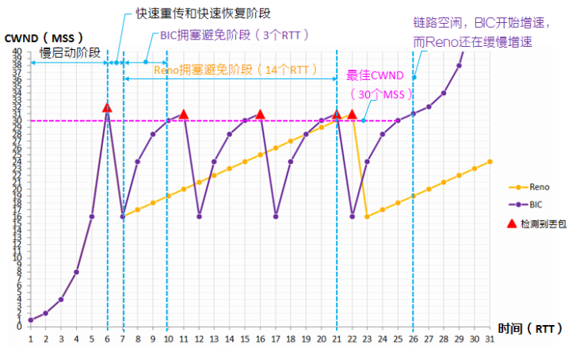

## 拥塞控制介绍

### 概念介绍

TCP发送数据的过程中，如果发送端发送数据过慢， 会浪费网络带宽，影响应用进程间的通信，甚至导致应用进程间通信失败。 所以，我们希望尽快将数据传送给接收端。 但如果发送端把数据发得过快，接收端就可能来不及接收，从而造成数据丢失。 **拥塞控制算法通过一套复杂的机制来控制 TCP 报文发送端可发送报文的数量， 让发送方的发送速率不要太快，要让接收方来得及接收，同时也不能发送太慢，以免浪费带宽、影响业务。** 从而实现在无丢包或者少丢包的情况下，最大化地利用网络带宽，提高传输效率；尽快将 TCP 报文送达接收端，降低传输时延。

### 指标
计算机网络环境复杂，瞬息万变， TCP 拥塞控制算法也在不断地演进，来寻求带宽、丢包、时延的更优解决方案。 衡量拥塞控制算法的优劣，有两个重要指标：
* 带宽利用率：即当网络空闲时，算法能否尽快找到发送端每次最大可发送报文的数量，最大化地利用网络带宽，提升传输速率，提高通信效率。
* 公平性：即算法能否在各 TCP 连接间公平地分配带宽。例如，当新会话加入、争抢网络带宽时，算法应能使现有的各 TCP 连接让出部分带宽，让新连接可以和旧连接公平地分享带宽。 

带宽利用率高、公平性好的算法更优。

## Reno和BIC实现
### 算法原理
Reno 和 BIC 算法基于丢包反馈，让发送端被动调整拥塞窗口 CWND 的大小来控制本端可发送的报文段 MSS 的数量，从而提高带宽利用率，避免网络拥塞。这两种算法均包含慢启动、快速重传、快速恢复和拥塞避免四个阶段。
1. **慢启动阶段**
   TCP 连接建立后，算法启动并进入慢启动阶段。 慢启动的原理为：当发送端开始发送数据时，如果立即将较大的发送窗口中的全部报文段都直接发送到网络中，由于这时还不清楚网络的状况，可能会引起网络拥塞。于是，慢启动采用探测的方法，由小到大逐渐增大发送端的拥塞窗口数值，来找到适合当前网络传输的最佳拥塞窗口 CWND 的大小。 

    慢启动的具体做法为：
    * TCP 进程以较低速率开始发包（对应的拥塞窗口 CWND 为一个 MSS），然后每经过一个往返时延 RTT， 拥塞窗口 CWND 加倍，以便快速探测到最佳 CWND。
    * 同时，算法设置了慢开始门限 ssthresh（初始值为 256 个 MSS）。 ssthresh 用于防止拥塞窗口 CWND 无限制过快增长引起网络拥塞，如果 CWND≥ssthresh，网络仍无丢包，则直接进入拥塞避免阶段，开始慢增长拥塞窗口 CWND。 
     
2. **快速重传阶段**
   拥塞窗口 CWND 不断增加，势必会引起网络拥塞导致丢包。如果发送端连续收到三个确认序号相同的 ACK 报文， TCP 进程会认为当前网络拥塞导致丢包。算法进入快速重传阶段，并立即重传对方尚未收到的报文段，而不用等到 ACK 报文超时再重传。
    
3. **快速恢复阶段**
   快速恢复通常和快速重传配合使用。 快速重传后，算法进入快速恢复阶段。 在未使用快速恢复处理机制时，发送端一旦发现网络出现拥塞，就将拥塞窗口降低到 1 个 MSS，然后开启慢启动阶段。这种做法比较极端，实际上网络并没有拥塞到只够传输一个 MSS 的程度，它导致 TCP 传输速率不能很快地恢复到正常状态。 为了解决这个问题， TCP 发展出了快速恢复处理机制。 在快速恢复阶段：
    * 算法将拥塞窗口 CWND 减小到丢包时拥塞窗口 CWND 的一半，来快速解除网络拥塞，恢复网络畅通。
    * 同时，算法将慢开始门限 ssthresh 设置为丢包时拥塞窗口 CWND 的一半，以便进入拥塞避免阶段。
     
4. **拥塞避免阶段**
    在拥塞避免阶段， 慢开始门限 ssthresh 保持不变， 拥塞窗口 CWND≥慢开始门限 ssthresh，若网络无丢包，则拥塞窗口 CWND 缓慢增加，用于探测链路中是否存在富余带宽；若网络出现丢包，Reno 和 BIC 均会再次进入快速重传、快速恢复和拥塞避免阶段。
 

### 算法原理示意图
假设当前网络最多可传输 30 个 MSS.

## BBR实现

### 算法原理
BBR 通过以下四个状态，来交替循环探测，得出 BtlBw 和 RTprop： StartUp（启动阶段）、 Drain（排空阶段）、 ProbeBW（BtlBw 探测阶段）、 ProbeRTT（RTprop 探测阶段）。
1. **StartUP（启动阶段）**
   TCP 连接建立后， BBR 算法启动并进入 StartUP 状态。 StartUP 状态对应 BBR 算法的启动阶段，目标是获得当前瓶颈带宽 BtlBw。
    为了快速探测到最佳发包速率， StartUP 状态下， BBR 规定发包增益系数为 pacing_gain=2.89， 当前发包速率=pacing_gain*BtlBw=2.89*BtlBw。 
    BBR 探测瓶颈带宽 BtlBw 的流程如下：
    1. 初始情况下，发送端以一个较低发包速率向接收端发送报文，获得当前的即时带宽 BW。 BW>当前的瓶颈带宽 BtlBw（初始值为 0），更新瓶颈带宽 BtlBw=即时带宽 BW。
    2. 更新发包速率， 当前发包速率=pacing_gain*BtlBw=2.89*BtlBw。发送端以更高的发布速率发包。
    3.  BBR 继续更新瓶颈带宽 BtlBw，使用新的瓶颈带宽 BtlBw 计算新的发包速率，用新的发包速率发送报文。
    **如果 BBR 连续 3 次探测、计算得到的即时带宽 BW 均小于当前瓶颈带宽 BtlBw 的 1.25 倍，则说明已经获得了当前瓶颈带宽 BtlBw，且链路可能出现了发包缓存现象**， BBR 进入 Drain状态。
     
2. **Drain 状态（排空阶段）**
   因为在 StartUP 状态 BBR 以 2.89 倍速增加发包速率， 随着发包速率的不断增长， 链路中可能出现发包缓存现象（网络传输设备、接收端将来不及处理的报文存放到接收缓冲区）。发包缓存意味着13报文到达接收设备时不能立即被处理，这会导致往返时延 RTT 增大，当越来越多的报文被缓存，可能会导致接收设备的接收缓冲区被占满，报文被丢弃。 TCP 需要重传报文，导致传输性能急剧恶化。
    BBR 追求带宽利用率最高，即以瓶颈带宽 BtlBw 发包， 同时，链路中尽量不要出现发包缓存，以便报文能以最快速度、最短时间送达接收端。于是在 StartUP 状态后， BBR 会进入 Drain 状态，用于排空 StartUP 状态下，链路中缓存的报文。
    BBR 排空链路中缓存报文的流程如下：
    1. 为了排空链路中缓存的报文， BBR 需要降低发包速度。 Drain 状态下，协议规定发包增益系数pacing_gain=0.35，发包速率=pacing_gain*BtlBw=0.35*BtlBw。
    2. BBR以0.35*BtlBw速率发包，直至BBR检测到链路中正在传输的报文数小于BtlBw*RTprop。此时 BBR 认为链路队列中缓存的报文已经排空，进入 ProbeBW 状态。
    
3. **ProbeBW 状态（BtlBw 探测阶段）**
   探测到瓶颈带宽 BtlBw，并排空链路中缓存的报文后， BBR 进入 ProbeBW 状态。在该阶段， BBR大部分时间以瓶颈带宽 BtlBw 作为发包速率平稳发包，小部分时间会小幅调整发包速率，来探测新的瓶颈带宽 BtlBw。
    BBR 绝大部分时间处于 ProbeBW 状态。该状态以 8 个 RTT 为周期循环滚动，包括 6 个平稳周期、    1 个上升周期、 1 个减少周期：
    * 6 个平稳周期：为了充分利用网络带宽， BBR 在 6 个 RTT 内进行平稳发包。 此时的发包增益
    系数 pacing_gain=1，发包速率=pacing_gain*BtlBw＝1*BtlBw。
    * 1 个上升周期：为了探测更高的 BtlBw， BBR 在 1 个 RTT 内短暂地提高发包速率。 此时的发
    包增益系数 pacing_gain=1.25，发包速率=pacing_gain*BtlBw＝1.25*BtlBw。
    * 1 个减少周期： 为了排空链路队列中可能缓存的报文， BBR 在 1 个 RTT 内短暂地降低发包速
    率。 此时的发包增益系数 pacing_gain=0.75，发包速率=pacing_gain*BtlBw＝0.75*BtlBw。 
      
4. **ProbeRTT 状态（RTprop 探测阶段）**
    RTprop 指链路中没有排队且无丢包时，一个包在链路中一个来回所需的时长，即往返时延 RTT 的极小值。通常情况下，链路创建后， RTprop 即为固定值。但传输网络是共享网络，链路中没有本连接发送的报文，但是可能有其它会话发送的报文，所以， 为了确保 RTprop 值的可靠性， BBR 会检测 RTprop 值的刷新状态。 若超过 10 秒 RTprop 还未更新，则无论当前 BBR 处在 StartUP、 Drain和 ProbeBW 中的哪个状态，均进入 RTprop 状态。
    进入 RTprop 状态后， BBR 将 CWND 拥塞窗口 CWND 减小到 4 并持续 200 毫秒，通过断崖式减少发包来清空链路中缓存的报文，以便探测新的 RTprop。

### 算法原理示意图

BBR 经过 StartUp 和 Drain 阶段后，进入相对平稳的发包阶段，相同时间段内 BBR的吞吐量要大于 Reno 和 BIC。 当网络传输能力提高，最佳拥塞窗口 CWND 从 30 个 MSS 提升到48 个 MSS， BIC 最少只需 5 个 RTT 即可达到最佳拥塞窗口 CWND，而 BBR 需要 7 个 RTT，拥塞窗口 CWND 才上升到 1.25*30=37.5（取 37 个 MSS）， BBR 再经过 8 个 RTT，拥塞窗口 CWND 上升到 1.25*37=46.25（取 46 个 MSS）。