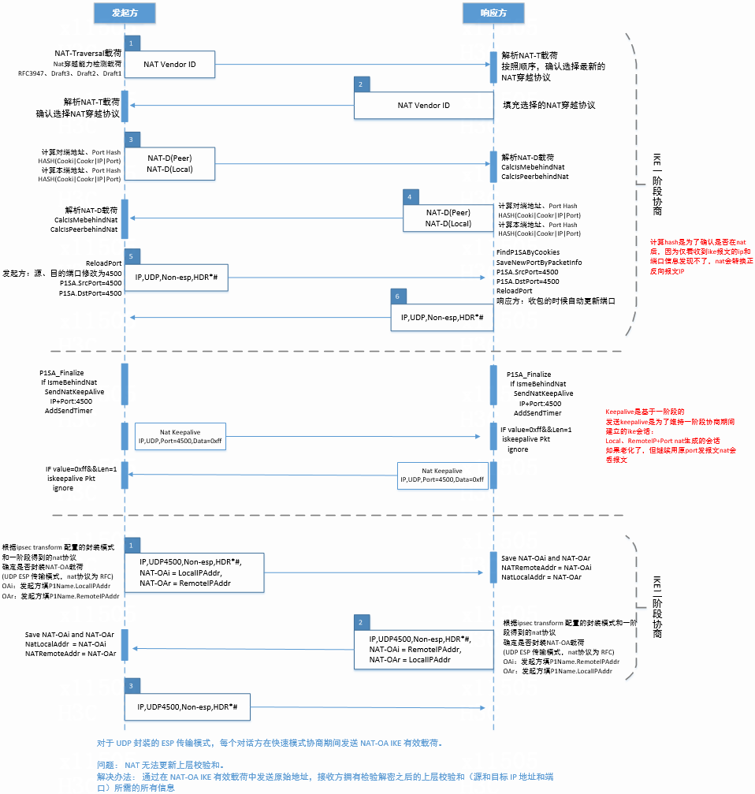

## 报文格式

### IKE报文格式
```
0               7              15              23              31
+---------------------------------------------------------------+  -----
|                                                               |    |     
+                     IKE_AS Initiator SPI                      +    |
|                                                               |    |
+---------------------------------------------------------------+    |
|                                                               |    |
+                     IKE_AS Responder SPI                      +    |
|                                                               |    |
+---------------------------------------------------------------+  IKE Header 
| Next Payload  |MjVer  |MnVer |Exchange Type   |     Flags     |    |
+---------------------------------------------------------------+    |
|                        Message ID                             |    |
+---------------------------------------------------------------+    |
|                        Length                                 |    |
+---------------------------------------------------------------+  -----
| Next Payload2 |C|  RESERVED  |          Payload Length        |   Payload Header
+---------------------------------------------------------------+  -----
|                                                               |
+                                                               +
|                           Payload                             |
+                                                               +
|                                                               |
+---------------------------------------------------------------+
```

### ESP报文格式
```
 0                   1                   2                   3
 0 1 2 3 4 5 6 7 8 9 0 1 2 3 4 5 6 7 8 9 0 1 2 3 4 5 6 7 8 9 0 1
+-+-+-+-+-+-+-+-+-+-+-+-+-+-+-+-+-+-+-+-+-+-+-+-+-+-+-+-+-+-+-+-+
|               Security Parameters Index (SPI)                 |
+-+-+-+-+-+-+-+-+-+-+-+-+-+-+-+-+-+-+-+-+-+-+-+-+-+-+-+-+-+-+-+-+
|                      Sequence Number                          |
+-+-+-+-+-+-+-+-+-+-+-+-+-+-+-+-+-+-+-+-+-+-+-+-+-+-+-+-+-+-+-+-+
|                    Payload Data* (variable)                   |
~                                                               ~
|                                                               |
+               +-+-+-+-+-+-+-+-+-+-+-+-+-+-+-+-+-+-+-+-+-+-+-+-+
|               |     Padding (0-255 bytes)                     |
+-+-+-+-+-+-+-+-+               +-+-+-+-+-+-+-+-+-+-+-+-+-+-+-+-+
|                               |  Pad Length   | Next Header   |
+-+-+-+-+-+-+-+-+-+-+-+-+-+-+-+-+-+-+-+-+-+-+-+-+-+-+-+-+-+-+-+-+
|         Integrity Check Value-ICV   (variable)                |
+                                                               +
|                                                               |
+-+-+-+-+-+-+-+-+-+-+-+-+-+-+-+-+-+-+-+-+-+-+-+-+-+-+-+-+-+-+-+-+
```
1. ESP Header  
   * SPI
   * Sequence Number  
2. 载荷数据
   * TCP/UDP Header + Application Data  
3. ESP Trailer
   * Padding
   * Pad Length
   * Next Header  
4. ESP Auth
   * ICV

- Security Parameters Index : 32比特。表示IPsec安全参数索引，用于给报文接收端识别SA。
- Sequence Number : 32比特。表示序列号，每发送一个报文，计数加1，例如每发一个SA报文序列号增加1。
- Payload Data* : 变长。表示有效载荷数据，包含由下一头部字段给出的变长数据。
- Padding : 0–255字节。表示填充字段，用于增加ESP报文头的位数。当待加密报文的长度不是加密算法所要求的长度时，需要进行填充补齐。
- Pad Length : 8比特。接收方根据该字段长度去除填充字段中的扩展位，置0时表示没有填充。
- Next Header : 8比特。表示ESP报文头的下一个载荷类型。
- Integrity Check Value-ICV : 可变长度，长度必须为32比特的整数倍。表示报文的ICV（Integrity Check Value，ICV）字段，用于接收方进行完整性校验。

```
传输模式：
             |<------ Authentication Fields --------->|
                      |<---- Encryption Fields ------>|
   +---------+--------+-----------+--------+----------+-------+
   | IP/IPv6 |  ESP   |  TCP/UDP  |  Data  |   ESP    |  ESP  |
   | Header  | Header |   Header  |        |  Trailer |  Auth |
   +---------+--------+-----------+--------+----------+-------+

隧道模式：
                 |<-------------- Authentication Fields ------------->|
                          |<----------- Encryption Fields ----------->|
   +-------------+--------+-----------+-----------+--------+----------+-------+
   | New IP/IPv6 |  ESP   |  IP/IPv6  |  TCP/UDP  |  Data  |   ESP    |  ESP  |
   |    Header   | Header |   Header  |   Header  |        |  Trailer |  Auth |
   +-------------+--------+-----------+-----------+--------+----------+-------+
```
#### ESP ICV
ESP Auth（完整性校验值 ICV）的存在与否，由在 IKE 协商阶段双方选择的加密套件决定。  
* 没有配置认证算法，ESP Auth字段为空。`IP头 ESP头 加密数据 ESP尾`  
* 配置了认证算法，ESP Auth字段包含ICV。 `IP头 ESP头 加密数据 ESP尾 ICV`
   1. 发送方对“ESP头 + 原始数据 + ESP尾”进行加密。
   2. 发送方再对“ESP头 + 加密数据 + ESP尾”计算ICV，放入 ​​ESP Auth​​ 字段。
   3. 接收方先验证ICV。如果通过，才进行解密。如果ICV校验失败，直接丢弃数据包。
*  集成式加密认证算法（ ​AEAD 算法​​）。 `IP头 ESP头 密文及认证标签 ESP尾`
   - AEAD 算法（如 AES-GCM）将加密和认证作为一个原子操作完成。  
   - 它输出两部分：​​密文​​ 和 ​​认证标签​​。  
   - 这个 ​​认证标签​​ 就起到了和 ICV 完全相同的作用（完整性校验和身份认证），但它被直接嵌入到加密数据载荷中，而不是放在一个独立的尾部字段里。  
   - 认证功能由 ​​认证标签​​ 完成，它和密文是不可分割的。接收方使用密钥解密并验证标签，任何对数据的篡改都会导致验证失败。  
        ```
        +--------+-----------+------------------------------+----------+
        | IP Hdr | ESP Hdr   |        Encrypted Data         | ESP   |
        |        | (SPI,Seq) | +---------------------------+ | Trlr  |
        |        |           | | TCP/UDP Hdr |    Data     | |       |
        |        |           | +---------------------------+ |       |
        |        |           | |     Authentication Tag    | |       |
        |        |           | +---------------------------+ |       |
        +--------+-----------+------------------------------+----------+
                                            ^
                                            |
                    （认证标签与密文集成，不存在独立的ESP Auth字段）
        ```

### AH报文格式
```
     0                   1                   2                   3
     0 1 2 3 4 5 6 7 8 9 0 1 2 3 4 5 6 7 8 9 0 1 2 3 4 5 6 7 8 9 0 1
   +-+-+-+-+-+-+-+-+-+-+-+-+-+-+-+-+-+-+-+-+-+-+-+-+-+-+-+-+-+-+-+-+
   | Next Header   |  Payload Len  |          RESERVED             |
   +-+-+-+-+-+-+-+-+-+-+-+-+-+-+-+-+-+-+-+-+-+-+-+-+-+-+-+-+-+-+-+-+
   |                 Security Parameters Index (SPI)               |
   +-+-+-+-+-+-+-+-+-+-+-+-+-+-+-+-+-+-+-+-+-+-+-+-+-+-+-+-+-+-+-+-+
   |                    Sequence Number Field                      |
   +-+-+-+-+-+-+-+-+-+-+-+-+-+-+-+-+-+-+-+-+-+-+-+-+-+-+-+-+-+-+-+-+
   |            Integrity Check Value-ICV (variable)               |
   +                                                               +
   |                    ... ...                                    |
   +-+-+-+-+-+-+-+-+-+-+-+-+-+-+-+-+-+-+-+-+-+-+-+-+-+-+-+-+-+-+-+-+
```
- Next Header : 8比特。表示认证头部之后的下一个负载。
- Payload Len : 8比特。表示AH报文头长度。AH的长度减2，4字节为计数单位。例如，有个96比特的认证值，长度将是"4"（即头部固定的3个4字节 + ICV的3个4字节 - 2）。对于IPv6，头部总长度必须为8字节的倍数。
- RESERVED : 16比特。用于预留将来使用。必须置0，接收时忽略。
- Security Parameters Index : 32比特。表示IPsec安全参数索引，用于给报文接收端识别SA。
- Sequence Number Field : 32比特。表示序列号，每发送一个报文，计数加1，例如每发一个SA报文序列号增加1。
- Integrity Check Value-ICV : 可变长度，长度必须为32比特的整数倍。表示报文的ICV（Integrity Check Value，ICV）字段，用于接收方进行完整性校验（Auth）。

```
传输模式：
   |<---Authentication Fields (Not including the variable field of IP header) --->|
   +-------------------+-------------------+------------------------+-------------+
   |     IP Header     |      AH Header    |     TCP/UDP Header     |     Data    |
   |   (protocol=51)   |                   |                        |             |
   +-------------------+-------------------+------------------------+-------------+

隧道模式：
   |<- Authentication Fields (Not including the variable field of New IP header) ->|
   +-----------------+-------------+-------------+------------------+--------------+
   |  New IP Header  |  AH Header  |  IP Header  |  TCP/UDP Header  |     Data     |
   |  (protocol=51)  |             |             |                  |              |
   +-----------------+-------------+-------------+------------------+--------------+
```
### AH和ESP组合使用
```
传输模式：
   |<-------------------    AH Authentication Fields    -------------------->|
   |                        |<----  ESP Authentication Fields  ----->|       |
   |                                  |<-- ESP Encryption Fields --->|       |
   +---------------+--------+---------+--------------------+-----------------+
   |   IP Header   |   AH   |   ESP   |  TCP/UDP  |  Data  |   ESP   |  ESP  |
   | (protocol=51) | Header |  Header |   Header  |        | Trailer |  Auth |
   +---------------+--------+---------+--------------------+-----------------+

隧道模式：
   |<----------------------    AH Authentication Fields    ---------------------->|
   |                        |<------  ESP Authentication Fields  -------->|       |
   |                                  |<---- ESP Encryption Fields ------>|       |
   +---------------+--------+---------+--------+---------+------+---------+-------+
   | New IP Header |   AH   |   ESP   |   IP   | TCP/UDP | Data |   ESP   |  ESP  |
   | (protocol=51) | Header |  Header | Header |  Header |      | Trailer |  Auth |
   +---------------+--------+---------+--------+---------+------+---------+-------+
```

## ESP IV
- 需要携带IV的情况
  - 加密模式为CBC（如AES-CBC）
    IV是显式传输的，必须包含在ESP包中，位于加密数据之前。每次加密必须使用不同的随机IV。
    ```
    ESP报文结构示例：
     +----------------+----------------+----------------+----------------+
     | ESP头部        | IV (显式)       | 加密数据        | ESP尾部（ICV） |
     +----------------+----------------+----------------+----------------+
    ```
  - 加密模式为CTR（如AES-CTR）   
    IV（通常称为Nonce）需要显式传输，但可能通过计数器或其他机制生成。  
- 不需要携带IV的情况
   - AEAD模式（如AES-GCM、ChaCha20-Poly1305）   
     IV（Nonce）通常隐式生成，可能通过以下方式组合：
     - 固定字段（如SPI+序列号）：利用ESP头部中的SPI和序列号派生Nonce。
     - 隐式计数器：基于会话状态递增计数器生成。
     - 显式部分+隐式部分：例如，前4字节显式传输，后8字节隐式派生。

- IV的核心作用
  - 确保相同明文在不同加密操作中生成不同密文，防止模式分析攻击。
  - 支持加密算法的正确运行（如CBC需要随机IV，CTR/GCM需要唯一Nonce）。

## AAD（Authenticated Associated Data，关联认证数据）
- 定义
  - AAD是明文传输的关联数据，在加密过程中参与完整性校验（生成认证标签），但不加密。
- 作用
  - 保护协议头部或上下文信息（如ESP头部、IP地址、端口等），确保其未被篡改。
- 何时需要AAD？
  - 使用AEAD模式时（如AES-GCM、ChaCha20-Poly1305）   
    AEAD算法要求同时处理加密数据和关联数据，生成一个认证标签（ICV）。此时必须指定AAD。
    ```
    ESP报文结构（AEAD模式）：
     +----------------+----------------+----------------+----------------+
     | ESP头部        | 隐式/显式Nonce | 加密数据       | 认证标签（ICV）|
     +----------------+----------------+----------------+----------------+ 
    ```
    - AAD内容：通常包括ESP头部中的SPI、序列号等字段。
    - 验证流程：接收方使用相同的AAD重新计算认证标签，确保数据完整性和来源可信。
  - 传统加密模式（如AES-CBC）  
    不涉及AAD，完整性由独立的ICV（如HMAC-SHA256）保护。
- AAD的典型应用场景
  - 保护协议头部信息（如SPI、序列号），防止重放或篡改。
  - 绑定加密数据与网络层上下文（如源/目的IP），增强安全性。

## AEAD
既对数据进行加密，又对加密数据和关联数据进行完整性验证。   
AEAD（Authenticated Encryption with Associated Data） 是“带有关联数据的认证加密”，是一种同时提供数据加密和数据完整性验证的加密模式。其核心目标是确保数据的机密性、完整性和真实性，同时允许对部分未加密的关联数据进行完整性保护。   

### AEAD 的组成
- Authenticated Encryption（认证加密）：   
  将加密和认证（完整性校验）结合为单一操作，确保加密后的数据未被篡改。
  - 加密：保护数据的机密性。
  - 认证：生成一个认证标签（如HMAC或Poly1305标签），验证数据完整性。

- Associated Data（关联数据，AD）：   
  不需要加密但需完整性保护的明文数据（如协议头、会话ID）。这些数据参与认证标签的计算，但不加密。

### AEAD 的工作流程
- 输入：
  - 明文：需要加密的数据。
  - 密钥：用于加密和认证的密钥。
  - 关联数据（AD）：需保护完整性的明文数据。
  - Nonce/IV：随机数或初始化向量，确保相同明文生成不同密文。

- 输出：
  - 密文：加密后的数据。
  - 认证标签：基于明文和关联数据生成的校验值（如AES-GCM的认证标签）。

- 解密与验证：
  - 使用相同的密钥和Nonce解密密文。
  - 重新计算认证标签，验证其与接收到的标签是否一致。
  - 若验证失败：数据被篡改，丢弃数据包。

### AEAD 的核心优势
- 效率：加密和认证合并为一步，减少计算开销。
- 安全性：同时保护机密性和完整性，抵御重放、篡改和中间人攻击。
- 灵活性：允许部分数据保持明文（如协议头），但仍确保其完整性。

### 常见的 AEAD 算法
- AES-GCM	：基于AES的Galois/Counter模式，支持高速加密和认证。	应用场景：TLS、IPSec、磁盘加密
- ChaCha20-Poly1305 ：结合流加密（ChaCha20）和多项式MAC（Poly1305），性能优于AES-GCM。应用场景：移动设备、低功耗场景
- AES-CCM ：结合CBC-MAC和CTR模式，适用于资源受限设备。	应用场景：物联网（IoT）

### 关联数据（AD）的作用
- 保护协议头信息：例如IPSec中的SPI（安全参数索引）、序列号，或TLS中的记录头。
- 防重放攻击：通过包含序列号或时间戳，确保数据包的唯一性。
- 上下文绑定：将加密数据与通信上下文（如会话ID）关联，防止跨会话攻击。

### AEAD 在协议中的应用
- TLS 1.3：强制使用AEAD模式（如AES-GCM、ChaCha20-Poly1305），关联数据包括记录层头部（协议版本、内容类型）。
- IPSec ESP：使用AES-GCM时，关联数据包含ESP头部中的SPI和序列号。
- HTTP/3：通过QUIC协议使用AEAD保护数据包头部和负载。
  
### 安全注意事项
- Nonce唯一性：同一密钥下Nonce必须唯一，否则会导致加密失效（如AES-GCM的Nonce重复会导致密钥暴露）。
- 密钥管理：定期轮换密钥，避免长期使用同一密钥。
- 算法选择：优先选择经过广泛验证的算法（如AES-GCM、ChaCha20-Poly1305），避免使用弱算法（如AES-CBC+HMAC-SHA1）。

##  AES-GCM举例
* 明文50字节
* 明文块 = 原始数据(50) + Padding(12) + Pad Length(1) + Next Header(1) = 64 字节
* 加密块 = 加密(64 字节) = 64 字节密文
* Authentication Tag = 16 字节（独立附加）
* 完整 ESP 报文  
  `SPI(4) + Seq(4) + IV(8) + 加密块(64) + Tag(16) = 96 字节`

### 报文结构
```
0                   1                   2                   3
 0 1 2 3 4 5 6 7 8 9 0 1 2 3 4 5 6 7 8 9 0 1 2 3 4 5 6 7 8 9 0 1
+-+-+-+-+-+-+-+-+-+-+-+-+-+-+-+-+-+-+-+-+-+-+-+-+-+-+-+-+-+-+-+-+
|               Security Parameters Index (SPI)                 |
+-+-+-+-+-+-+-+-+-+-+-+-+-+-+-+-+-+-+-+-+-+-+-+-+-+-+-+-+-+-+-+-+
|                      Sequence Number                          |
+-+-+-+-+-+-+-+-+-+-+-+-+-+-+-+-+-+-+-+-+-+-+-+-+-+-+-+-+-+-+-+-+
|         Initialization Vector (IV)                            |
|         (长度由算法决定，AES-GCM 通常为 12 字节)               |
|                                                               |
+-+-+-+-+-+-+-+-+-+-+-+-+-+-+-+-+-+-+-+-+-+-+-+-+-+-+-+-+-+-+-+-+
|         ... IV continued ...                                 |
+-+-+-+-+-+-+-+-+-+-+-+-+-+-+-+-+-+-+-+-+-+-+-+-+-+-+-+-+-+-+-+-+
|                    Encrypted Payload (变长)                   |
|   +---------------------------------------------------------+ |
|   |  Payload Data (原始数据，如 TCP/UDP 头 + 应用数据)       | |
|   |  +-----------------------------------------------------+ | |
|   |  | 原始数据 (示例: 50 字节)                            | | |
|   |  +-----------------------------------------------------+ | |
|   |  | Padding (填充字节，满足对齐要求)                    | | |
|   |  | 示例: 12 字节 (值全为 0x00)                         | | |
|   |  +-----------------------------------------------------+ | |
|   |  | Pad Length (填充长度)                               | | |
|   |  | 1 字节 (值 = 填充长度，如 0x0C)                    | | |
|   |  +-----------------------------------------------------+ | |
|   |  | Next Header (上层协议标识)                          | | |
|   |  | 1 字节 (如 TCP=0x06, UDP=0x11)                      | | |
|   |  +-----------------------------------------------------+ | |
|   |                                                         | |
|   +---------------------------------------------------------+ |
|   | Authentication Tag (认证标签)                             | |
|   | 固定长度 (AES-GCM=16 字节)                               | |
|   +---------------------------------------------------------+ |
+-+-+-+-+-+-+-+-+-+-+-+-+-+-+-+-+-+-+-+-+-+-+-+-+-+-+-+-+-+-+-+-+
```
* 加密范围：
  * Payload Data + Padding + Pad Length + Next Header​​被整体加密​
* 认证范围：
  Authentication Tag 基于以下计算：  
  * ESP 头（SPI + Seq）
  * IV
  * 加密后的数据块（含 Pad Length + Next Header）

### 抓包实例
```
Internet Protocol Version 4, Src: 192.168.1.1, Dst: 192.168.1.2
Protocol: ESP (50)
Encapsulating Security Payload (ESP)
    SPI: 0xcafebabe
    Sequence: 100
    IV: a1b2c3d4e5f6
    [Encrypted Payload: 84 bytes]  ← 含加密的50+12+1+1
    [Authentication Tag: 16 bytes] → 5f6e7d8c9a0b...

# 解密后的视图（Wireshark 解析）:
Decrypted ESP:
    SPI: 0xcafebabe
    Sequence: 100
    IV: a1b2c3d4e5f6
    Payload Data: 48656c6c6f... (50 bytes)  # "Hello..." 的十六进制
    Padding: 0102030405060708090a0b0c (12 bytes)
    Pad Length: 12
    Next Header: TCP (6)
    Authentication Tag: 5f6e7d8c9a0b... (16 bytes)
```

## ESN
在 IPSec 和 IKE 协议中，ESN（Extended Sequence Number，扩展序列号） 是一项用于增强抗重放攻击能力的功能.   

### ESN 的核心概念
- 传统序列号：
  IPSec 的 ESP（封装安全载荷）和 AH（认证头）协议默认使用 32 位序列号，用于标识数据包的顺序，防止重放攻击。  
  - 当序列号达到最大值（2^32−1）后会回绕（归零），在高流量场景中可能导致快速循环，增加重放攻击风险。

- ESN（扩展序列号）：   
  将序列号扩展为 64 位（高 32 位隐式，低 32 位显式传输），显著增大序列号空间，降低循环频率，提升安全性。
  - 显式部分：实际传输的 32 位序列号（与旧协议兼容）。
  - 隐式部分：本地维护的高 32 位计数器，不传输但参与完整性校验。
  
### ESN 的作用
- 抗重放攻击：
  64 位序列号在极端流量下（如高速网络）仍能保证数十年不重复，彻底避免 32 位序列号快速循环的问题。
- 兼容性：
  显式传输的 32 位序列号与旧设备兼容，隐式高 32 位通过密钥派生算法（如 HMAC）保护。
- 完整性保护：
  隐式高 32 位参与认证数据的生成（如 HMAC 或 AEAD 的 ICV），确保攻击者无法篡改序列号。

###  ESN 在 IPSec 中的实现
- IPSec 数据包格式（ESP为例）
  ```
  +---------------+---------------+---------------+---------------+
  | ESP头部       | 显式序列号    | 加密数据       | 认证标签（ICV）|
  | (SPI等)       | (低32位)      | (含隐式高32位) |               |
  +---------------+---------------+---------------+---------------+
  ```
  - 显式序列号：32 位，与旧协议兼容。
  - 隐式高 32 位：由本地维护，通过密钥和计数器生成，不传输，参与 ICV 计算。
- 抗重放窗口
  - 接收方维护一个滑动窗口（通常为 64 位），验证数据包序列号是否在合法范围内（即未过期或重复）。
  - ESN 的 64 位空间使窗口覆盖范围极大，几乎不可能被耗尽。

### ESN 在 IKE 中的应用
- SA 协商阶段   
  双方在 IKE_SA_INIT 或 CREATE_CHILD_SA 交换中，通过 Notify 载荷（类型 ESN）声明支持 ESN.
- 密钥派生：   
  隐式高 32 位通过密钥派生函数（如 PRF）与密钥材料绑定，确保攻击者无法伪造.
- 兼容性处理：   
  若对端不支持 ESN，则回退到 32 位序列号.

## NAT
分支：私网192.168.1.100，公网198.51.100.1   
总部：203.0.113.1   

### 阶段一：IKE协商和NAT检测
#### IKE_SA_INIT请求
```
分支 → NAT → 总部
[IP: 192.168.1.100:500 → 203.0.113.1:500]
[IKE_SA_INIT请求 + NAT-D载荷(哈希1)]
↓ NAT转换 ↓
[IP: 198.51.100.1:62000 → 203.0.113.1:500]
```

#### IKE_SA_INIT响应 + NAT检测
```
总部 → NAT → 分支
[IP: 203.0.113.1:500 → 198.51.100.1:62000]
[IKE_SA_INIT响应 + NAT-D载荷(哈希2)]
↓ NAT反向转换 ↓
[IP: 203.0.113.1:500 → 192.168.1.100:500]

哈希1 ≠ 哈希2 → 检测到NAT存在！
```

#### 切换到UDP 4500端口（NAT-T模式）
```
分支 → NAT → 总部
[IP: 192.168.1.100:4500 → 203.0.113.1:4500]
[UDP封装：IKE_AUTH请求]
↓ NAT转换 ↓
[IP: 198.51.100.1:62001 → 203.0.113.1:4500]
```

### 阶段二：数据传输（ESP over UDP）
#### 正常数据传输
```
分支发送数据到总部：
原始数据包：[IP: 192.168.1.100 → 10.1.1.10][数据]

ESP加密后：[IP: 192.168.1.100 → 203.0.113.1][ESP头][加密数据]

NAT-T封装后：
[IP: 192.168.1.100:4500 → 203.0.113.1:4500]
[UDP头][非ESP标记(0x00000000)][ESP头][加密数据]
↓ NAT转换 ↓
[IP: 198.51.100.1:62001 → 203.0.113.1:4500]
[UDP头][非ESP标记][ESP头][加密数据]
```

#### 总部接收处理
```
总部收到后处理流程：
1. 识别目的端口4500 → NAT-T流量
2. 检查非ESP标记(0x00000000) → 确认是IPsec数据
3. 剥离UDP头和非ESP标记
4. 得到标准ESP包 → 解密处理
5. 获得原始数据包：[IP: 192.168.1.100 → 10.1.1.10][数据]
```

### 阶段三：NAT保活机制
#### 维持NAT映射表项
```
分支定期发送NAT保活包：
分支 → NAT → 总部
[IP: 192.168.1.100:4500 → 203.0.113.1:4500]
[UDP头][非ESP标记(0x00000000)] ← 空载荷，仅用于保活
↓ NAT转换 ↓
[IP: 198.51.100.1:62001 → 203.0.113.1:4500]

目的：刷新NAT设备的会话超时计时器
```

### 流程图
 