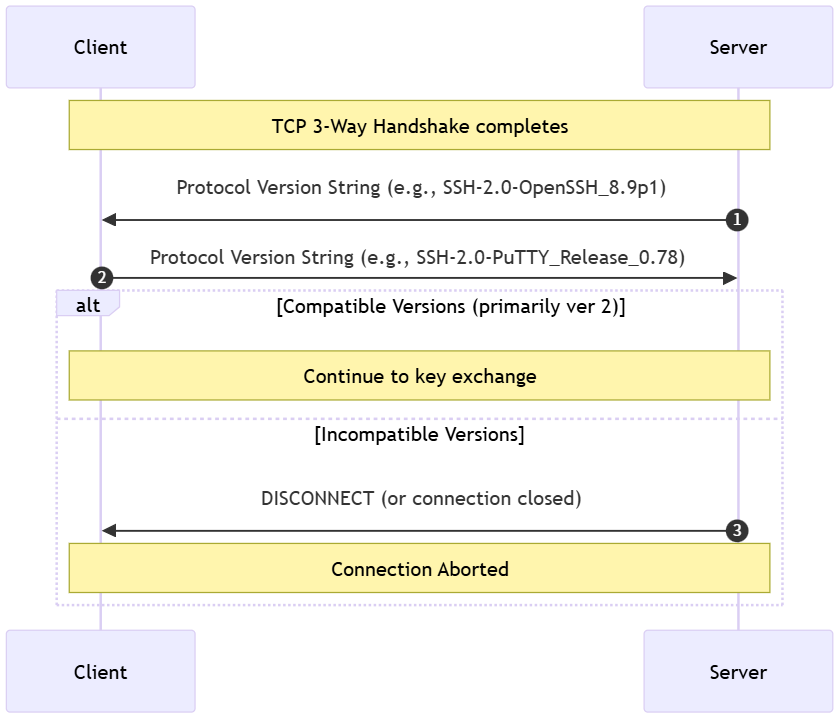
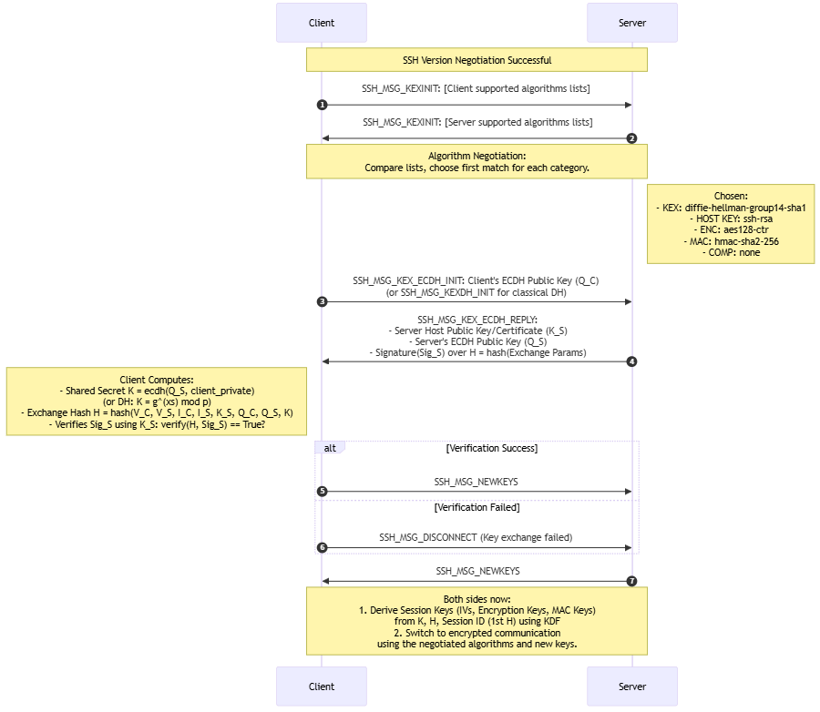
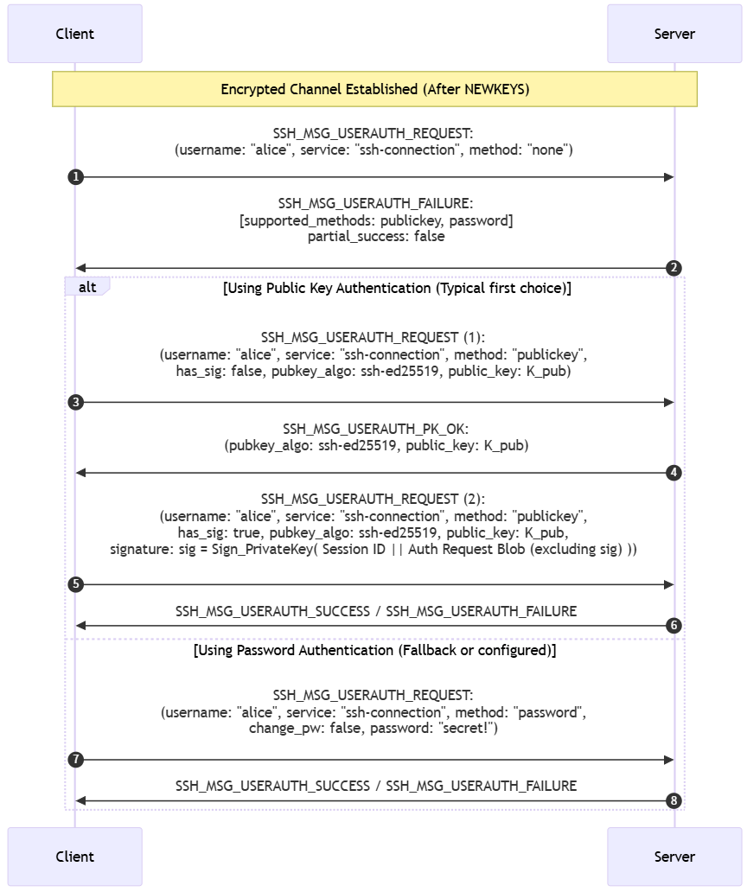
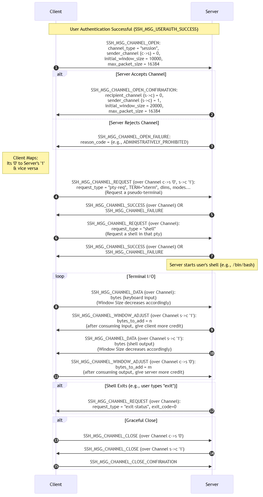

## 概述  
1.  TCP连接建立  
2.  SSH协议协商  
   a. 版本协商  
   b. 算法协商与密钥交换  
   c. 用户认证  
3.  SSH连接协议阶段  
   a. 打开会话通道  
   b. 启动子系统  
4.  协议交互阶段（SFTP）  
   a. SFTP初始化、打开文件请求、读取文件数据、关闭文件  
5.  连接关闭  
   a. 关闭会话通道  
   b. 关闭连接  

## 版本协商阶段  

### 交互流程
 

#### 详细步骤解释
1.  **TCP连接建立：** 客户端通过TCP端口22（默认）连接到服务器。标准的三次握手完成。
2.  **服务端发送版本：** 服务器检测到TCP连接建立后，**立即**发送它支持的SSH协议版本字符串。这是服务端发送的**第一条**SSH消息。
    *   **格式：** `SSH-<主版本>.<次版本>-<服务器软件标识>` (可选空格后跟注释) + `\r\n`
    *   **示例：** `SSH-2.0-OpenSSH_8.9p1 Ubuntu-3ubuntu0.4\r\n`
    *   **含义：** 服务端声明它支持的SSH最高主版本是2（通过`2.0`或`1.99`表示）。
3.  **客户端发送版本：** 客户端接收到服务端的版本字符串。
    *   **检查兼容性：** 客户端解析字符串，主要是`SSH-`后面的主版本号部分。
    *   **发送响应：** 客户端发送它所支持的SSH协议版本字符串。
    *   **格式：** `SSH-<主版本>.<次版本>-<客户端软件标识>` (可选空格后跟注释) + `\r\n`
    *   **示例：** `SSH-2.0-PuTTY_Release_0.78\r\n`
4.  **协商结果判定 (RFC关键解释)：**
    *   **兼容（继续）：** 如果**双方声明的主版本号都是`2`，或者一方声明`2.0`另一方声明`1.99`**，则认为双方支持SSH-2.0协议（RFC 4253 系列）。版本协商成功，连接将继续进行后续步骤（密钥交换算法协商）。
        *   `SSH-1.99` **明确代表** "我支持RFCs定义的SSH 2.0协议"。这是为了向后兼容一些旧的SSH-2.0客户端/服务器而设计的。在功能上，`SSH-2.0` 和 `SSH-1.99` 视为兼容。
    *   **不兼容（断开）：** 如果**双方声明的主版本号都不匹配，且没有任何一方声明`1.99`**（例如服务端发`SSH-1.5-...`，客户端发`SSH-2.0-...`），那么**任何一方都可以主动断开TCP连接**。通常服务端在识别到客户端发送的版本号不可接受时会主动断开。客户端在发送自己的版本号前如果已经发现服务端的版本号不可接受，也可能选择关闭连接或发送一个不可接受的版本号等待服务器断开。

### 总结
SSH版本号协商是一个基于简单文本交换的初步握手阶段：
1.  **服务器先行：** TCP连接成功后，服务器立即发送其支持的SSH协议版本字符串。
2.  **客户端响应：** 客户端接收后，发送其支持的SSH协议版本字符串。
3.  **协商依据：** 双方根据字符串中的主版本号（主要是 `2` 或 `1.99` 代表SSH-2.0）判断兼容性。
4.  **结果：** 兼容 (`2.0` <=> `2.0` 或 `2.0` <=> `1.99`) -> 继续连接。不兼容 (其他组合) -> 断开连接。
5.  **非加密：** 此阶段明文传输，不涉及任何密码学操作。

## 算法协商与密钥交换

### 交互流程


#### 详细步骤解释

1.  **交换算法提议 (`SSH_MSG_KEXINIT`) (几乎同时发送)：**
    *   客户端和服务端**在版本协商后立即、几乎同时**向对方发送 `SSH_MSG_KEXINIT` 消息。
    *   **消息内容：** 包含本方支持的所有算法列表（按优先级排序）及一些随机数据(`cookie`)。
    *   **协商规则：** 对每一种算法类别（密钥交换、主机密钥、加密算法等），双方取**客户端列表和服务端列表的交集，并选择客户端列表中第一个匹配的服务端支持项**。这是最关键的一步。
    *   **协商后确认：** 双方独立应用相同的规则，最终确定使用的**唯一一组算法组合**。

2.  **密钥交换消息 (`SSH_MSG_KEX_ECDH_INIT`/`SSH_MSG_KEXDH_INIT` & `SSH_MSG_KEX_ECDH_REPLY`/`SSH_MSG_KEXDH_REPLY`):**
    *   **客户端发起交换 (`Init`):** 客户端根据协商好的**密钥交换方法**，计算并发送其**交换公钥** (e.g., `Q_C` for ECDH, `e` for classical DH)。这是 `SSH_MSG_KEX_ECDH_INIT` 或 `SSH_MSG_KEXDH_INIT` 消息的内容。
    *   **服务器响应 (`Reply`):** 服务器：
        *   计算其**交换公钥** (e.g., `Q_S` for ECDH, `f` for classical DH)。
        *   计算 **`Shared Secret` (`K`)** (e.g., for ECDH: `K = ecdh(server_private, Q_C) = ecdh(client_private, Q_S)`, for classical DH: `K = f^x mod p = e^y mod p`)。
        *   构造 **`Exchange Hash` (`H`)**: `H = hash( V_C || V_S || I_C || I_S || K_S || Q_C || Q_S || K )`
            *   `V_C, V_S`: 客户/服务端版本字符串
            *   `I_C, I_S`: 客户/服务端在第一步 `SSH_MSG_KEXINIT` 中发送的随机数据 (Cookie)
            *   `K_S`: 服务器的**主机公钥**（或公钥证书）
            *   `Q_C, Q_S`: 客户/服务端的交换公钥
            *   `K`: 计算得到的 `Shared Secret`
            *   `hash`: 密钥交换方法中指定的哈希函数 (e.g., `SHA-256` for `ecdh-sha2-nistp256`, `SHA-1` for `diffie-hellman-group14-sha1`).
        *   **签名：** 服务器使用其**主机私钥**对计算的 `H` 值进行签名 (`Sig_S = Sign_PrivateHostKey(H)`)。
        *   **发送 `Reply`:** 将 `SSH_MSG_KEX_ECDH_REPLY` 或 `SSH_MSG_KEXDH_REPLY` 消息发送给客户端，包含：`服务器主机公钥 K_S`, `服务器交换公钥 (Q_S/f)`, `签名 Sig_S`.

3.  **客户端验证与共享密钥计算：**
    *   **计算 `K`:** 客户端收到 `Reply` 后，使用自己的交换私钥和服务器的交换公钥计算相同的 `Shared Secret K` (e.g., `K = ecdh(client_private, Q_S)` or `K = f^x mod p`)。
    *   **重建 `H`:** 客户端使用收到的数据和计算的 `K`，使用与服务端**相同的算法和输入顺序**，计算本地 `Exchange Hash H`。
    *   **验证签名 (`Verify`):** 客户端使用服务器在 `Reply` 中发来的**主机公钥 `K_S`**，验证签名 `Sig_S` 是否是对本地计算的 `H` 值的有效签名：`Verify_PublicHostKey(H, Sig_S) == True?`
        *   **通过：** 服务器身份得到初步验证。<u>**首次连接时，客户端通常会提示用户接受并信任此服务器的公钥(`K_S`)。**</u>
        *   **失败：** 立刻断开连接（`SSH_MSG_DISCONNECT`），警告可能的"中间人攻击(`MITM`)"或主机密钥变更。这是SSH安全性的基石之一。
    *   **计算 `Session ID`:** `Session ID` 被定义为本次连接的**第一个 `H` 值**（即本次密钥交换产生的 `H`）。它在整个连接生命周期（包括后续可能的重新密钥交换）中保持不变，是派生的输入因子。

4.  **通知新密钥 (`SSH_MSG_NEWKEYS`):**
    *   **客户端发送 (`SSH_MSG_NEWKEYS`):** 客户端在签名验证通过后，发送 `SSH_MSG_NEWKEYS` 消息给服务端，表示："我已计算好新密钥，准备切换到加密通信"。
    *   **服务器发送 (`SSH_MSG_NEWKEYS`):** 服务器也发送 `SSH_MSG_NEWKEYS` 消息给客户端。
    *   **密钥生效点：** 双方在**发送** `SSH_MSG_NEWKEYS` 消息后，应立即**开始使用**新派生的会话密钥处理**随后接收**的任何消息。在**接收**到对方的 `SSH_MSG_NEWKEYS` 消息后，必须**使用新密钥处理随后接收**的任何消息。

5.  **密钥派生 (`KDF - Key Derivation Function`)：**
    *   **输入：** 双方使用协商好的**密钥派生函数（KDF）**，基于以下输入派生出实际的会话密钥：
        *   `Shared Secret K` (双方计算一致).
        *   `Exchange Hash H` (计算得出并已验证).
        *   `Session ID` (第一个 `H`).
        *   特定的派生值（如 `'A'`, `'B'`, `'C'`, `'D'`...），不同值用于派生不同类型的密钥。
    *   **输出：** 派生出**多组**对称密钥：
        *   **Initial IV Client to Server (`IV_C2S`):** 客户端发送数据的初始化向量。
        *   **Initial IV Server to Client (`IV_S2C`):** 服务器发送数据的初始化向量。
        *   **Encryption Key Client to Server (`E_C2S`):** 客户端发送数据的加密密钥。
        *   **Encryption Key Server to Client (`E_S2C`):** 服务器发送数据的加密密钥。
        *   **Integrity Key (MAC) Client to Server (`MAC_C2S`):** 客户端发送数据的MAC密钥。
        *   **Integrity Key (MAC) Server to Client (`MAC_S2C`):** 服务器发送数据的MAC密钥。
    *   **公式 (概念化)：**
        *   `Key = KDF(K, H, Session ID, Letter, KeyLength)` (`Letter` = 'A' for IV_C2S, 'B' for E_C2S, 'C' for MAC_C2S, 'D' for IV_S2C, 'E' for E_S2C, 'F' for MAC_S2C). 实际的KDF（如基于SHA-256的伪随机函数）负责安全地从这些输入中生成所需的字节流。
    *   **为什么需要KDF？** 直接使用原始 `K` 不安全且不够用。KDF 确保派生出的密钥在密码学上是强壮的、独立的，并满足算法需要的长度。

### 密钥计算
1.  **`Shared Secret (K)`:** 通过协商的密钥交换方法（如 ECDH, DH）计算：`K = ecdh(Q_S, client_private) = ecdh(Q_C, server_private)` or `K = f^x mod p = e^y mod p`。这是核心的**秘密值**。
2.  **`Exchange Hash (H)`:** `H = hash( V_C || V_S || I_C || I_S || K_S || Q_C || Q_S || K )`。此哈希值**绑定**了整个交换过程的参数。
3.  **`Session ID`:** 首次密钥交换产生的 `H` 值。在整个会话中唯一标识该连接。
4.  **`Session Keys` (IV_C2S, E_C2S, MAC_C2S, IV_S2C, E_S2C, MAC_S2C):** 最终通过 `KDF(K, H, Session ID, ...)` 派生得到。

### 总结
SSH密钥交换和算法协商阶段是一个复杂但结构清晰的过程：
1.  **算法列表交换：** 双方互换支持算法列表 (`SSH_MSG_KEXINIT`)。
2.  **算法选择：** 双方按规则匹配，确定最终使用的算法套件。
3.  **密钥交换：** 执行选定方法交换公钥数据 (`Init` / `Reply`)，计算共享密钥 `K`。
4.  **服务器签名与验证：** 服务器对交换哈希 `H` 签名证明身份 (`Reply`内含)，客户端使用服务器公钥验证。
5.  **会话密钥派生：** 使用 `K`、`H`、`Session ID` 通过 `KDF` 派生出多组加密和MAC密钥。
6.  **密钥切换：** 发送 `SSH_MSG_NEWKEYS` 通知对方开始使用新密钥加密和认证后续通信。

这个阶段是SSH协议安全性的核心，它确保了后续所有通信的**保密性**（加密算法）、**完整性**（MAC算法）以及**服务器身份的真实性**（主机密钥签名验证）。一旦完成，连接即进入**加密通信阶段**，为最终的**用户认证阶段**提供了一个安全的通道。


## 用户认证

### 交互流程


#### 详细步骤解释

1.  **初始探路（可选，推荐） - `SSH_MSG_USERAUTH_REQUEST` with method `none`:**
    *   **客户端：** 发送一个请求消息 `SSH_MSG_USERAUTH_REQUEST`，指定要认证的用户名 (`username`)、请求认证的服务名（固定为`ssh-connection`）和认证方法 `none`。
    *   **目的：** 并非为了成功认证，而是“试探”服务器。服务器会回应一个`SSH_MSG_USERAUTH_FAILURE`消息。
    *   **服务器 (`SSH_MSG_USERAUTH_FAILURE`):** 在此失败消息中，服务器**必须**返回它所支持的、可用于该用户的**认证方法列表**（按服务器偏好排序），并设置 `partial_success: false`（表明没有进行任何有效尝试）。
    *   **意义：** 客户端获得服务端支持的认证方式列表（e.g., `publickey,password`），可以选择最合适的方式开始正式认证，避免了盲目尝试。这是RFC推荐的实践。

2.  **公钥认证 (`publickey`) (通常首选):**
    *   **公钥列表探测 (可选步骤 `SSH_MSG_USERAUTH_REQUEST` with `has_sig: false`):**
        *   **客户端：** 发送 `SSH_MSG_USERAUTH_REQUEST` 消息。
            *   `method = "publickey"`
            *   `has_sig = false` (表示不包含签名)。
            *   包含要使用的公钥算法 (`pubkey_algo`, e.g., `ssh-ed25519`, `rsa-sha2-512`) 和实际的公钥数据 (`public_key` = `K_pub`)。
        *   **目的：** 检查服务器是否接受**这个特定的公钥**用于认证指定的用户（`alice`）。避免用户交互后才发现密钥未被授权。
        *   **服务器 (`SSH_MSG_USERAUTH_PK_OK` or `SSH_MSG_USERAUTH_FAILURE`):**
            *   如果服务器在用户`alice`授权公钥列表中找到 `K_pub`（例如在 `~alice/.ssh/authorized_keys` 文件中），则回复 `SSH_MSG_USERAUTH_PK_OK`。这个消息**只表示服务器接受该公钥进行签名认证**，不代表认证成功。
            *   如果没找到，则回复 `SSH_MSG_USERAUTH_FAILURE` (可能包含更新后的支持方法列表)。
    *   **正式签名认证 (`SSH_MSG_USERAUTH_REQUEST` with `has_sig: true`):**
        *   **客户端：** 收到 `SSH_MSG_USERAUTH_PK_OK` 后, 再次发送 `SSH_MSG_USERAUTH_REQUEST`。
            *   `method = "publickey"`
            *   `has_sig = true`
            *   再次包含 `pubkey_algo`, `public_key` (`K_pub`)。
            *   包含**数字签名 (`signature`)**: `sig = Sign_PrivateKey(Session ID || Auth Request Blob)`
                *   **`Sign_PrivateKey`**: 使用与 `K_pub` 对应的**客户端用户私钥** (`K_priv`)。
                *   **签名的内容 (`Session ID || Auth Request Blob`):**
                    *   `Session ID`: 来自第一个密钥交换的 `H` 值，是整个会话的唯一标识符。
                    *   `Auth Request Blob` = `[byte(SSH_MSG_USERAUTH_REQUEST)] || string(username) || string(service) || string("publickey") || TRUE (has_sig=true) || string(pubkey_algo) || string(public_key)` (注意：这个 blob 中**不包含签名`signature`本身**）。签名计算时需要用 `Session ID` 打头并连接这个 blob。
        *   **服务器验证：**
            *   服务器验证算法 `pubkey_algo` 是否与其配置兼容且能处理 `K_pub`。
            *   使用存储的 `K_pub`，根据指定的 `pubkey_algo` 验证签名 (`sig`) 是否是对字符串 `Session ID || Auth Request Blob` 的有效签名。
            *   确认 `Session ID` 确实属于当前活动会话（防止重放攻击）。
        *   **服务器应答：**
            *   如果所有验证通过，回复 `SSH_MSG_USERAUTH_SUCCESS`（认证成功）。
            *   如果有任何一个验证失败（错误的`Session ID`、无效签名、密钥未授权等），回复 `SSH_MSG_USERAUTH_FAILURE` (可能包含更新后的支持方法列表)。

3.  **密码认证 (`password`):**
    *   **客户端 (`SSH_MSG_USERAUTH_REQUEST`):**
        *   发送包含用户名、服务名、方法`password`的请求。
        *   设置 `change_pw: false`（表示不请求更改密码）。
        *   包含密码 (`password`)（明文形式被**加密信道加密**传输）。
    *   **服务器验证：**
        *   服务器使用其本地密码存储（如 `/etc/shadow` 或LDAP/AD数据库）和配置的认证协议（如PAM）来验证提供的用户名和密码是否匹配。
        *   服务器可能需要根据配置进行额外的策略检查（如账户是否被锁定、密码是否过期等）。
    *   **服务器应答：**
        *   如果密码验证通过且符合所有策略，回复 `SSH_MSG_USERAUTH_SUCCESS`。
        *   如果验证失败或策略拒绝，回复 `SSH_MSG_USERAUTH_FAILURE` (会包含支持方法的更新列表)。

4.  **键盘交互认证 (`keyboard-interactive`):**
    *   **客户端 (`SSH_MSG_USERAUTH_REQUEST` 请求使用该方法):**
        *   初始请求方法设置为 `keyboard-interactive`。
    *   **服务器 (`SSH_MSG_USERAUTH_INFO_REQUEST`):**
        *   服务器发送此消息，包含一个或多个提示 (`prompt`) 和一个布尔值 `echo`（指示客户端是否应在显示用户输入时回显字符，例如输入密码时不应回显）。
    *   **客户端 (`SSH_MSG_USERAUTH_INFO_RESPONSE`):**
        *   客户端提示用户输入所需信息。
        *   收集响应后发送此消息，包含每个提示对应的回答 (`response`)。
    *   **服务器验证：**
        *   服务器根据提示和响应进行验证（通常由一个可配置模块处理，如PAM）。这可以进行多轮交互。
    *   **服务器最终应答 (`SSH_MSG_USERAUTH_SUCCESS` or `SSH_MSG_USERAUTH_FAILURE`):**
        *   在完成所有必要的交互轮次后，服务器发送最终认证结果。

5.  **认证失败处理 (`SSH_MSG_USERAUTH_FAILURE`):**
    *   当客户端尝试一种方法失败时，服务器回复此消息。
    *   该消息**必须**包含此时**服务器仍可接受的认证方法列表 (`authentications that can continue`)**。这个列表会根据已尝试的失败而更新（例如，公钥失败后可能只剩 `password`）。
    *   包含一个布尔值 `partial_success`: 只有当客户端已经**部分完成了认证**（例如在多重认证中通过了第一步），并且后续还有其他步骤时，才设置为 `true`。在单一方法尝试失败时通常为 `false`。
    *   客户端根据这个更新的列表决定接下来尝试哪种方法（如果有的话）。

6.  **认证成功 (`SSH_MSG_USERAUTH_SUCCESS`):**
    *   当客户端成功通过**完整的认证流程**（单方法或多重认证）后，服务器发送此消息。
    *   收到此消息后：
        *   **SSH连接建立完成：** 用户认证阶段正式结束。
        *   **切换到请求的服务：** 连接进入最初客户端请求的“命名服务”阶段 (`service request`)。对于交互式登录，就是启动用户的Shell；对于端口转发/SFTP，就是启动对应的处理进程。后续所有通信均为**已认证的加密通信**。
    *   此消息在整个连接生命周期中**只发送一次**。

### 密钥计算
*   **公钥认证：** 核心是客户端使用**客户端用户的私钥 (`K_priv`)** 对 `Session ID || Auth Request Blob` 进行签名 `sig`。使用的具体签名算法由公钥类型和协商确定（如 `ssh-ed25519`, `rsa-sha2-512`）。
    *   签名公式：`sig = Sign_K_priv( Session ID || Auth Request Blob )`
*   **密码认证：** **不涉及密码学计算验证**。密码在加密信道中以加密形式传输，服务器通过本地存储的凭证哈希（如bcrypt, sha512crypt）进行验证。服务器验证公式：`PasswordValid = CheckHash( server_stored_hash, submitted_password )`。
*   **其他认证 (e.g., `gssapi-with-mic`):** 可能涉及复杂的握手和密钥计算，通常使用外部协议（如Kerberos）。

### 总结
SSH用户认证阶段是建立最终交互通道前的最后一道安全闸门：
1.  **基础交互：** `REQUEST` -> `SUCCESS` / `FAILURE` / (`PK_OK`, `INFO_REQUEST`/`RESPONSE`)。
2.  **主要方式：**
    *   **`publickey` (最安全):** 客户端使用用户私钥对包含 `Session ID` 的信息签名证明身份。通常分两步：验证公钥有效性 (`has_sig=false`) 再签名 (`has_sig=true`)。
    *   **`password` (易用):** 客户端在加密信道中发送密码，服务器比对密码库。
    *   **`keyboard-interactive` (灵活):** 多轮交互问答，适用于多因素或自定义提示。
    *   **其他 (`gssapi`, `hostbased`):** 使用更复杂的外部机制。
3.  **失败反馈：** `SSH_MSG_USERAUTH_FAILURE` 告知客户端剩余可用方法，驱动下一步尝试。
4.  **安全上下文：** 所有通信在已建立的加密和完整性保护的信道中进行。
5.  **成功信号：** `SSH_MSG_USERAUTH_SUCCESS` 标志认证完成，连接进入服务处理阶段 (如启动Shell)。

这个阶段灵活地支持多种认证机制，结合安全通道，在易用性和安全性之间提供强大平衡。公钥认证因其非对称加密特性和避免传输秘密的优势，成为默认推荐的方式。

## 会话

### 核心概念：通道 (`Channel`)
*   **虚拟连接：** 一个逻辑上的、全双工的数据管道，运行在底层的、安全的SSH传输连接之上。
*   **独立性与复用：** 一次SSH连接内可以同时打开多个通道（如一个Shell会话 + 多个SFTP传输 + 端口转发），彼此隔离，互不影响。
*   **唯一标识：** 每个通道由一对数字唯一标识：`sender channel`（发起方视角的通道ID）和 `recipient channel`（接收方视角的通道ID）。客户端和服务器各自维护本地ID到对方ID的映射。
*   **生命周期：**
    1.  **Open:** 请求方发送 `SSH_MSG_CHANNEL_OPEN`。
    2.  **Confirm/Fail:** 接收方回复 `SSH_MSG_CHANNEL_OPEN_CONFIRMATION` 或 `SSH_MSG_CHANNEL_OPEN_FAILURE`。
    3.  **Active:** 通过 `SSH_MSG_CHANNEL_REQUEST` 启动服务，通过 `SSH_MSG_CHANNEL_DATA` 传输数据。
    4.  **Close:** 任意一方发送 `SSH_MSG_CHANNEL_CLOSE`，收到确认后通道关闭。
*   **流量控制：**
    *   **窗口 (`window size`)：** 接收方分配给发送方的信用额度，表示“你最多还能发给我多少字节的数据”。初始值在 `OPEN` 或 `OPEN_CONFIRMATION` 中指定。
    *   **最大报文大小 (`max packet size`)：** 双方协商的单个 `SSH_MSG_CHANNEL_DATA` 报文能携带的最大应用数据长度。
    *   **窗口更新 (`SSH_MSG_CHANNEL_WINDOW_ADJUST`)：** 接收方处理数据后，恢复额度（增大对方的窗口值），发送给发送方。
    *   **目的：** 防止接收方缓冲区溢出，实现发送方与接收方处理能力的协调。发送方只有在 `window size > 0` 时才能发送新的应用数据包，且数据包大小不能超过 `max packet size`。

### 交互流程


#### 详细步骤解释 (以交互式 Shell 为例)
1.  **打开会话通道 (`SSH_MSG_CHANNEL_OPEN` & `SSH_MSG_CHANNEL_OPEN_CONFIRMATION`):**
    *   **客户端：** 发送 `SSH_MSG_CHANNEL_OPEN` 请求打开一个新通道。
        *   `channel_type = "session"`: 指定这是一个通用的会话通道，用于运行服务。
        *   `sender_channel (id_c) = 0`: 客户端分配给这个通道的**本地ID**（从0开始编号）。
        *   `initial_window_size = w_c` (e.g., 10000): 客户端赋予**服务器**发送数据的初始**信用额度**（字节数）。
        *   `max_packet_size = m` (e.g., 16384): 客户端声明单个数据包能接受的**最大应用数据长度**。
    *   **服务器：**
        *   接受请求：回复 `SSH_MSG_CHANNEL_OPEN_CONFIRMATION`。
            *   `recipient_channel (r_s) = id_c = 0`: 服务器上对应的**对方（客户端）通道ID** (即`id_c`)。
            *   `sender_channel (id_s) = 1`: 服务器分配给这个通道的**本地ID**（从0开始独立编号）。
            *   `initial_window_size = w_s` (e.g., 20000): 服务器赋予**客户端**发送数据的初始**信用额度**。
            *   `max_packet_size = n` (e.g., 16384): 服务器声明单个数据包能接受的**最大应用数据长度** (通常双方协商取较小值或相同值)。
        *   拒绝请求：回复 `SSH_MSG_CHANNEL_OPEN_FAILURE` (附带拒绝原因码)。

2.  **为会话请求伪终端 (`SSH_MSG_CHANNEL_REQUEST` "`pty-req`"):**
    *   **客户端：** 在成功打开的通道 (例如 客户端ID `0` <-> 服务器ID `1`) 上，发送 `SSH_MSG_CHANNEL_REQUEST`。
        *   `request_type = "pty-req"`
        *   `want_reply = TRUE`: 要求服务器回复结果 (通常是)。
        *   参数：指定终端类型 (如 `TERM=xterm`)、窗口大小 (rows, cols)、终端模式等。
    *   **服务器：**
        *   如果可以分配伪终端 (`pty`)，回复 `SSH_MSG_CHANNEL_SUCCESS`。
        *   如果无法分配（例如不支持），回复 `SSH_MSG_CHANNEL_FAILURE` (可能导致后续启动Shell失败)。

3.  **启动Shell (`SSH_MSG_CHANNEL_REQUEST` "`shell`"):**
    *   **客户端：** 在同一条通道上发送另一个 `SSH_MSG_CHANNEL_REQUEST`。
        *   `request_type = "shell"`
        *   `want_reply = TRUE`
    *   **服务器：**
        *   如果启动Shell成功 (例如找到并执行用户的默认Shell如 `/bin/bash`)，回复 `SSH_MSG_CHANNEL_SUCCESS`。
        *   如果启动失败（如Shell路径错误、权限不足），回复 `SSH_MSG_CHANNEL_FAILURE`。
        *   **关键动作:** 服务器在回复成功后，会将该通道的标准输入、标准输出、标准错误流绑定到新启动的Shell进程上。

4.  **交互式数据传输 (`SSH_MSG_CHANNEL_DATA` & `SSH_MSG_CHANNEL_WINDOW_ADJUST`):**
    *   **客户端输入 -> 服务器 (Shell stdin):**
        *   客户端用户输入字符。
        *   客户端在**窗口允许 (`w_s > 0`)** 且**数据大小不超过 `max_packet_size`** 的前提下，发送 `SSH_MSG_CHANNEL_DATA` 报文，将数据发送给服务器。
        *   服务器收到数据包后：
            *   处理数据：将字节流传送给Shell的**标准输入**。
            *   **消耗信用:** 该通道上服务器的接收窗口 `w_s` 减少已接收数据包的应用数据长度。
            *   **恢复窗口 (`SSH_MSG_CHANNEL_WINDOW_ADJUST`):** 当服务器处理完一部分数据，释放了缓冲区空间，可以再次接受数据时，它通过发送 `SSH_MSG_CHANNEL_WINDOW_ADJUST` (指定 `bytes_to_add = delta_w`) 来增加客户端可用的发送窗口 `w_s`。客户端接收后增加 `w_s += delta_w`。
    *   **服务器输出 (Shell stdout/stderr) -> 客户端:**
        *   Shell进程产生输出。
        *   服务器在**窗口允许 (`w_c > 0`)** 且**数据大小不超过 `max_packet_size`** 的前提下，发送 `SSH_MSG_CHANNEL_DATA` 报文，将输出数据通过该通道发送给客户端。
        *   客户端收到数据包后：
            *   显示输出：将字节流在终端上显示给用户。
            *   **消耗信用:** 该通道上客户端的接收窗口 `w_c` 减少。
            *   **恢复窗口 (`SSH_MSG_CHANNEL_WINDOW_ADJUST`):** 当客户端处理完输出（显示后），它发送 `SSH_MSG_CHANNEL_WINDOW_ADJUST` 来增加服务器可用的发送窗口 `w_c`。服务器接收后增加 `w_c += delta_w`。

5.  **传递Shell退出状态 (`SSH_MSG_CHANNEL_REQUEST` "`exit-status`"):**
    *   当Shell进程正常退出 (用户输入`exit`或程序执行完毕)。
    *   **服务器：** 在该通道上发送 `SSH_MSG_CHANNEL_REQUEST`。
        *   `request_type = "exit-status"`
        *   `exit_status = n` (n为进程退出状态码，0通常表示成功)。
    *   **客户端：** 收到后，知道Shell已结束，可以准备关闭通道。

6.  **关闭通道 (`SSH_MSG_CHANNEL_CLOSE` & `SSH_MSG_CHANNEL_CLOSE_CONFIRMATION`):**
    *   **发起方 (客户端或服务器):** 当确定不再需要通道（如Shell退出），发送 `SSH_MSG_CHANNEL_CLOSE` (指定要关闭的通道ID)。
    *   **接收方：** 收到 `CLOSE` 后：
        *   停止在该通道上发送新数据 (应用层)。
        *   尽可能发送完缓冲区和管道中的数据 (可选)。
        *   回复 `SSH_MSG_CHANNEL_CLOSE` **进行确认**（即使由对方发起关闭）。
    *   **发起方：** 收到对方的 `CLOSE` 报文后，回复 `SSH_MSG_CHANNEL_CLOSE_CONFIRMATION` **进行最终确认**。
    *   **通道状态:** 双方完成上述握手后，都认为该通道已关闭，释放其资源。

#### Crtl-C处理
在SSH的交互式Shell会话中，当用户在**客户端的终端**按下 `Ctrl-C` 时，信号的处理涉及多层协作，最终目标是终止**远程服务器上正在运行的前台进程**。以下是完整的信号传递和处理流程：

##### 1. **客户端本地响应（终端驱动层）**
- **终端驱动捕获`Ctrl-C`**：  
  客户端的终端仿真器（如 `xterm`、`iTerm` 或 `ssh` 命令行本身）捕获 `Ctrl-C` 按键（ASCII码 `0x03`）。
- **生成 `SIGINT` 信号**：  
  终端驱动向 **本地 SSH 客户端进程**（例如 `ssh` 命令）发送 `SIGINT` 信号。
- **客户端进程响应**：  
  SSH 客户端默认忽略 `SIGINT`（不终止自身），转而通过 SSH 协议向服务器发送信号请求。

##### 2. **SSH 协议层的信号传递**
- **构造信号请求**：  
  客户端在当前的 **Shell 通道**上发送一条 `SSH_MSG_CHANNEL_REQUEST` 消息，关键字段包括：
  ```plaintext
  request_type = "signal"
  signal_name  = "INT"          # SIGINT 的协议名称
  recipient_channel = [当前Shell通道ID]
  ```
- **加密传输**：  
  该消息通过已建立的加密通道（使用密钥交换阶段派生的会话密钥）发送至服务器。

##### 3. **服务器端处理信号（`sshd` 进程）**
- **`sshd` 接收信号请求**：  
  服务器端的 `sshd` 守护进程解析请求，验证通道有效性（通道必须关联存活进程）。
- **向进程组发送 `SIGINT`**：  
  `sshd` 调用 `kill(-pid, SIGINT)`，向远程 Shell 进程的**整个进程组（Process Group）** 发送 `SIGINT`。  
  - **为何是进程组？**  
    Shell 会话中的前台命令（如 `sleep 100`）及其子进程同属一个进程组。发送到进程组确保信号覆盖所有前台进程。

##### 4. **远程 Shell 和进程的响应**
- **Shell 进程响应**：  
  远程 Shell（如 `bash`）默认将 `SIGINT` 传递给**前台进程组**。Shell 自身通常忽略 `SIGINT`（避免意外退出）。
- **目标进程终止**：  
  前台进程（例如正在运行的 `vim` 或 `ping`）捕获 `SIGINT` 后：
  - 默认行为是**立即终止**（`Terminate`）。
  - 若进程注册了自定义信号处理器（如 `signal(SIGINT, handler)`），则执行自定义逻辑（如保存文件）。
- **子进程清理**：  
  进程终止后，Shell 回收资源，向客户端发送**退出状态**（`exit-status = 130`，表示由 `SIGINT` 终止）。

##### 5. **异常场景处理**
| **场景**                     | **处理逻辑**                                                                 |
|------------------------------|----------------------------------------------------------------------------|
| **无前台进程**               | 信号被 Shell 忽略（例如在空命令行按 `Ctrl-C` 时仅输出 `^C`，不产生实际效果） |
| **进程阻塞 `SIGINT`**        | 进程不终止（例如 `nohup` 或代码中忽略 `SIGINT`），用户需用 `kill -9` 强杀   |
| **SSH 通道断开**             | 服务器向进程组发送 `SIGHUP` 终止所有关联进程（通过 `ClientAliveInterval` 触发） |
| **流量控制阻塞**             | 若窗口耗尽，信号请求可能被延迟传递（需等待 `WINDOW_ADJUST` 恢复窗口）        |

##### 关键点：
1. **信号起点在客户端终端**，但实际目标是远程进程。
2. **`SIGINT` 通过 SSH 协议显式传递**，需依赖已建立的 Shell 通道。
3. **进程组机制确保前台命令及其子进程一同终止**。
4. **退出状态 `130`**（`128 + SIGINT=2`）是远程进程被 `Ctrl-C` 终止的标准标识。

通过这一协作机制，用户在本地按下 `Ctrl-C` 就能安全地中断远程命令，其效率接近本地操作，这也是 SSH 交互体验的核心优势之一。

### 其他服务类型 (简要说明)

*   **`exec` (执行单命令):**
    *   类似 `shell` 请求，但 `request_type = "exec"`。
    *   必须附带一个参数 `command = "command_to_run"`。
    *   通道只保持打开直到命令执行完毕，然后服务器发送 `exit-status`。
*   **`subsystem` (启动子系统):**
    *   `request_type = "subsystem"`, 最常用的是 `sftp` 子系统 (`subsystem_name = "sftp"`)。
    *   启动后，客户端和服务器通过该通道传输特定于子系统的协议消息 (如SFTP数据包)。
*   **`tcpip-forward` (端口转发):**
    *   **本地转发 (`local`):**
        *   客户端请求：`SSH_MSG_CHANNEL_REQUEST` -> `request_type = "tcpip-forward"` + `bind_address`, `bind_port`。
        *   服务器在指定端口打开监听 (`bind_address:bind_port`)。
        *   当远程客户端连接到此监听端口时，服务器在SSH连接上创建**新通道** (`channel_type = "forwarded-tcpip"`)，并将连接数据代理转发给客户端。
    *   **远程转发 (`remote`):**
        *   客户端请求：`SSH_MSG_CHANNEL_REQUEST` -> `request_type = "tcpip-forward"` + `bind_address`, `bind_port` (在**服务器**主机上监听)。
        *   当本地客户端连接到指定端口时，服务器将此连接通过SSH连接以**新通道** (`channel_type = "forwarded-tcpip"`) 方式通知客户端，由客户端进行实际的远程连接和目标数据的代理。
*   **`signal` (发送信号):**
    *   `request_type = "signal"`, `signal_name = (e.g., "TERM", "HUP")`。
    *   向在该通道上运行的进程发送信号。

### 密钥计算
*   **不适用直接的新密钥计算：** 会话阶段本身不产生新的独立密钥。所有数据传输使用的是在**密钥交换阶段**派生的**会话密钥** (`E_C2S`, `E_S2C`, `MAC_C2S`, `MAC_S2C`) 进行加密和认证。
*   **密钥的应用：** 对于在通道上传送的 `SSH_MSG_CHANNEL_*` 消息（包括数据和请求）：
    *   **加密：** 使用该方向上传输的加密密钥 (`E_C2S` 用于C->S, `E_S2C` 用于S->C)。
    *   **消息认证码 (MAC):** 使用该方向上传输的MAC密钥 (`MAC_C2S` 用于C->S, `MAC_S2C` 用于S->C) 计算MAC，附加在加密数据之后，确保完整性。

### 总结
SSH会话请求阶段是连接的核心功能区：
1.  **通道是核心：** 通过创建和管理`channel`实现在单条安全连接上的多服务复用。
2.  **标准请求 (`request_type`)：** `shell`(交互), `exec`(单命令), `subsystem`(如`sftp`), `tcpip-forward`(端口转发) 是基础应用服务。
3.  **流量控制基石：** `window size` 和 `max packet size` + `WINDOW_ADJUST` 实现了精准的数据流管理。
4.  **通道生命周期管理：** `OPEN` -> (`REQUEST`/`DATA`/`ADJUST`) -> (`exit-status`/`signal`) -> `CLOSE` (握手式关闭) 定义了清晰的状态流转。
5.  **数据安全传输：** 会话阶段依赖于密钥交换阶段派生的密钥，对数据进行加密和完整性保护。
6.  **交互基础：** 伪终端 (`pty-req`) 是终端仿真交互的关键预备。
7.  **扩展性强：** `subsystem` 机制为自定义协议（如SFTP）提供了标准接入点，`port forwarding` 极大扩展了SSH的实用场景。

该阶段的设计使得SSH不仅是一个安全的远程登录工具，更是一个强大的安全应用通信隧道和转发平台。理解通道机制和标准请求类型是深入掌握SSH应用的关键。
