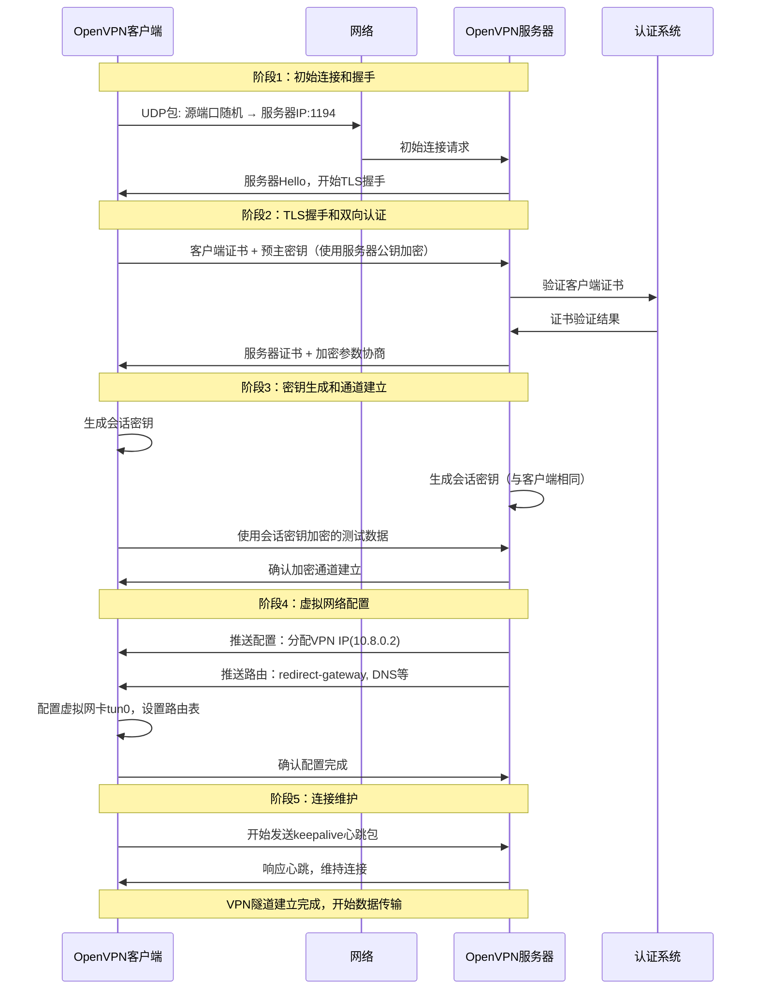
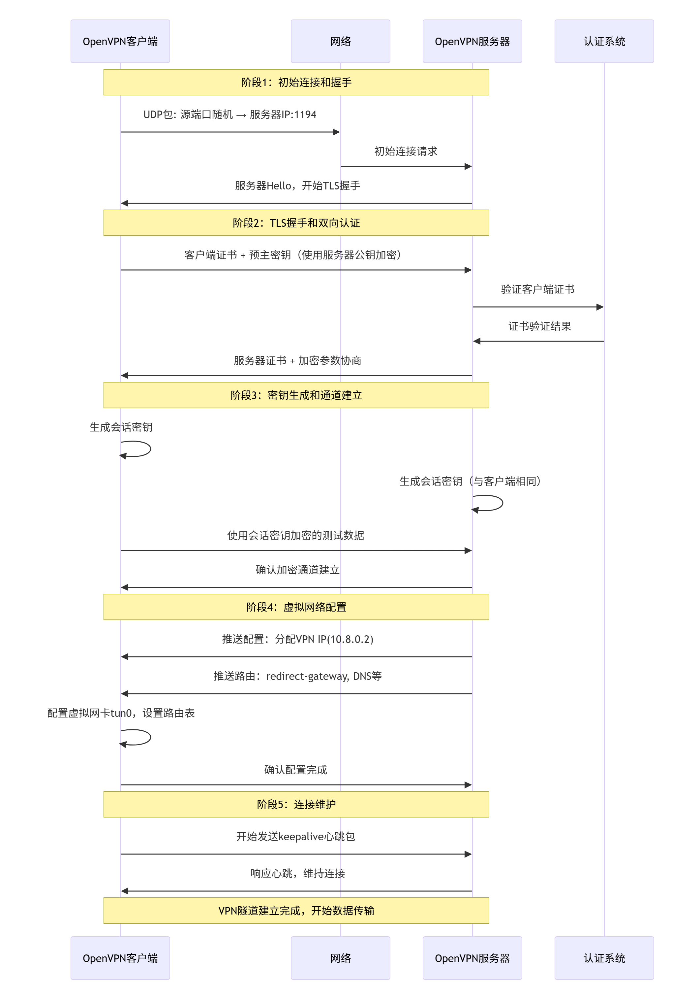

## 概述  


## 关键配置
### 服务端
1. 基本网络配置
   ``` bash
    # VPN网络定义
    server 10.8.0.0 255.255.255.0
    # 用途：定义VPN虚拟网络的IP地址范围，服务器自动获取10.8.0.1，客户端从10.8.0.2开始分配

    port 1194
    # 用途：指定OpenVPN监听的端口号，默认1194

    proto udp
    # 用途：指定协议，udp（性能好）或tcp（穿透性强但性能稍差）

    dev tun
    # 用途：使用TUN（IP层隧道）或TAP（以太网层隧道），TUN更常用
   ```
2. 加密和认证配置
   ``` bash
    # 证书和密钥文件
    ca ca.crt
    cert server.crt
    key server.key
    dh dh2048.pem
    # 用途：PKI基础设施，用于TLS加密和客户端身份验证

    tls-auth ta.key 0
    # 用途：防止DoS攻击和端口扫描，增加安全性

    cipher AES-256-CBC
    # 用途：指定加密算法，AES-256-CBC是安全标准

    auth SHA256
    # 用途：指定数据完整性验证算法
   ```
3. 客户端管理和路由配置
   ``` bash
    # 客户端IP地址管理
    ifconfig-pool-persist ipp.txt
    # 用途：持久化客户端IP分配，重启后客户端能获得相同IP

    # 路由推送
    push "route 192.168.20.0 255.255.255.0"
    # 用途：告诉客户端通过VPN访问指定网络

    push "redirect-gateway def1 bypass-dhcp"
    # 用途：重定向客户端所有流量通过VPN（全局VPN）

    push "dhcp-option DNS 8.8.8.8"
    # 用途：推送DNS服务器给客户端

    # 客户端间通信
    client-to-client
    # 用途：允许VPN客户端之间直接通信

    # 客户端特定配置
    client-config-dir /etc/openvpn/ccd
    # 用途：为不同客户端提供特定配置（如固定IP、特定路由）
   ```
4. 性能和可靠性配置
   ``` bash
    keepalive 10 120
    # 用途：心跳检测，10秒ping一次，120秒超时

    comp-lzo
    # 用途：启用压缩（旧版本），新版本使用compress

    persist-key
    persist-tun
    # 用途：重启后保持密钥和隧道状态

    user nobody
    group nogroup
    # 用途：以非特权用户运行，增加安全性

    verb 3
    # 用途：日志详细级别（0-11，数字越大越详细）
   ```
5. 高级网络配置
   ``` bash
    # 多客户端支持
    duplicate-cn
    # 用途：允许同一证书多个客户端连接（不推荐生产环境）

    # 连接限制
    max-clients 100
    # 用途：限制最大客户端连接数

    # 子网划分（更大网络）
    server 10.8.0.0 255.255.0.0
    # 用途：定义更大的VPN网络（/16网段）
   ```

### 客户端
1. 基本连接配置
   ``` bash
    client
    # 用途：声明此为客户端配置

    dev tun
    # 用途：与服务器一致，使用TUN设备

    proto udp
    # 用途：与服务器一致的协议

    remote vpn.example.com 1194
    # 用途：VPN服务器地址和端口，可以是域名或IP

    resolv-retry infinite
    # 用途：DNS解析失败时无限重试

    nobind
    # 用途：客户端不绑定特定端口，使用临时端口
   ```
2. 认证配置
   ``` bash
    # 证书和密钥
    ca ca.crt
    cert client.crt
    key client.key

    # TLS认证
    tls-auth ta.key 1
    # 用途：与服务器tls-auth对应，1表示客户端模式

    remote-cert-tls server
    # 用途：要求服务器证书必须包含TLS扩展

    cipher AES-256-CBC
    auth SHA256
    # 用途：与服务器一致的加密和认证算法
   ```
3. 路由和网络配置
   ``` bash
    # 路由行为
    redirect-gateway def1
    # 用途：客户端启用全局VPN（所有流量走VPN）

    route 192.168.30.0 255.255.255.0
    # 用途：手动添加路由（特定网络走VPN）

    route 0.0.0.0 192.168.1.1
    # 用途：排除特定网络不走VPN

    # DNS配置
    dhcp-option DNS 8.8.8.8
    # 用途：设置VPN连接期间的DNS服务器
   ```
4. 性能和可靠性配置
   ``` bash
    persist-key
    persist-tun
    # 用途：与服务器一致，保持连接状态

    comp-lzo
    # 用途：启用压缩

    verb 3
    # 用途：日志级别

    mute 20
    # 用途：限制相同消息的重复输出
   ```
5. 高级客户端配置
   ``` bash
    # 多服务器配置
    remote server1.example.com 1194
    remote server2.example.com 1194
    remote-random
    # 用途：多个服务器备份，随机连接

    # 连接脚本
    up /etc/openvpn/update-resolv-conf
    down /etc/openvpn/update-resolv-conf
    # 用途：连接/断开时执行脚本（如更新DNS）

    # 身份验证
    auth-user-pass
    # 用途：提示输入用户名密码（二次认证）

    auth-nocache
    # 用途：不缓存密码在内存中
   ```

## 报文转发流程
一个典型的场景：客户端通过OpenVPN服务器访问Google。假设OpenVPN服务器配置了server 10.8.0.0 255.255.255.0，并且推送了redirect-gateway使得所有客户端流量都经过VPN。  
  
我们定义以下IP地址：  
- 客户端本地网络：客户端在家的内网IP是192.168.1.100，客户端的路由器执行NAT，路由器的公网IP是202.96.128.50。
- OpenVPN服务器：公网IP是123.123.123.123，VPN内网IP是10.8.0.1。
- 客户端在VPN内获得的IP是10.8.0.2。
- Google的IP我们假设为172.217.24.14。

 

 
