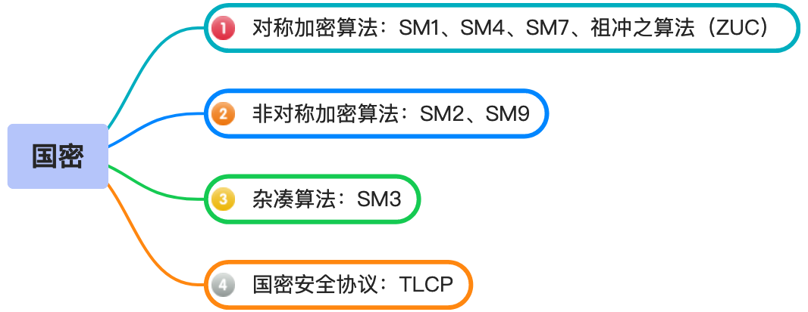

SM1 和 SM7 算法没有公开，仅以 IP 核的形式存在于芯片中，需要通过加密芯片的接口进行调用。

## SM3
“信息粉碎机”  
任何长度的数据丢进去，它都会搅拌、压缩、混合，最后吐出一段固定长度的“指纹”。这个指纹几乎不可能反推出原文，也很难找到两个不同输入产生同一个结果。这类算法在密码学里叫 **哈希函数（Hash Function）**。
### 长度
固定为 256 bit（32 字节）。

### 用处
* 数据完整性校验：文件或消息是否被篡改
* 数字签名：先对消息做哈希，再签名（SM2签名就是这样）
* 证书体系：生成证书指纹、签名摘要
* 密码协议：密钥派生、认证码等

## SM4
“高速密码搅拌机”  
把明文数据加密成看不懂的密文，只有拿到同一把密钥的人才能还原。这类算法在密码学里叫 **对称加密算法（Symmetric Encryption Algorithm）**。  

### 特点
SM4用于 **数据加密和解密**。特点是：
* 对称加密：加密和解密使用同一把密钥
* 分组密码：每次处理固定大小的数据块
* 分组长度：128 bit（16字节）
* 密钥长度：128 bit

## SM2
“国产版的椭圆曲线密码工具箱”  
SM2本质是一个 基于椭圆曲线密码学（ECC，Elliptic Curve Cryptography） 的公钥算法，用来解决三个问题：**加密、数字签名、密钥交换**。

### 数字签名
用于证明消息是谁发的，并保证消息没有被篡改。例如：    
* 电子合同签名
* 软件发布签名
* 证书签名（CA签发证书）

基本过程  
* 发送方：用私钥签名
* 接收方：用公钥验证

### 公钥加密
用于安全传输数据。例如：
* 国密TLS握手 ：客户端用服务器公钥加密，服务器用自己的私钥解密。

基本过程：
* 发送方：用对方公钥加密
* 接收方：用自己的私钥解密

### 密钥交换
用于双方在不安全网络上协商一个共同密钥。例如：
* HTTPS 握手 
* VPN  

双方通过各自密钥计算出 相同的共享密钥。


## SM9
SM9 是国家密码管理局发布的我国自主知识产权的标识密码算法（商密算法标准 GM/T 0044-2016），核心是**基于身份标识**（如手机号、邮箱、用户名等）实现**加密 / 解密、签名 / 验签**，无需额外的数字证书，属于**基于身份的密码体制（IBC）**。

### 用途
* 身份认证与签名：用用户标识（如邮箱）作为签名公钥，验证方无需证书即可验签，适用于电子合同、电子签章、物联网设备认证等场景；
* 数据加密与解密：用接收方标识作为加密公钥，只有对应私钥持有者能解密，适用于端到端加密、敏感数据传输等；
* 密钥协商：基于双方标识协商共享密钥，适用于 VPN、安全通信会话建立等。

### 核心思想
* 用户私钥由密钥生成中心KGC计算出来发给用户
  ```
  传统公钥  
  公钥 = 数学计算得到
  私钥 = 随机生成

  SM9
  公钥 = 用户身份ID
  私钥 = KGC计算得到
  ```
* KGC拥有 系统主私钥，因此理论上KGC可以生成所有用户私钥，这叫 Key Escrow（密钥托管）。换句话说：KGC是系统“上帝”。这在一些政务或受控网络中是可以接受的，但在完全开放的互联网体系里会引发信任问题。

### 优势和应用场景
* 仅需身份标识，无须证书，轻量化，适配物联网、移动终端等资源受限场景。


