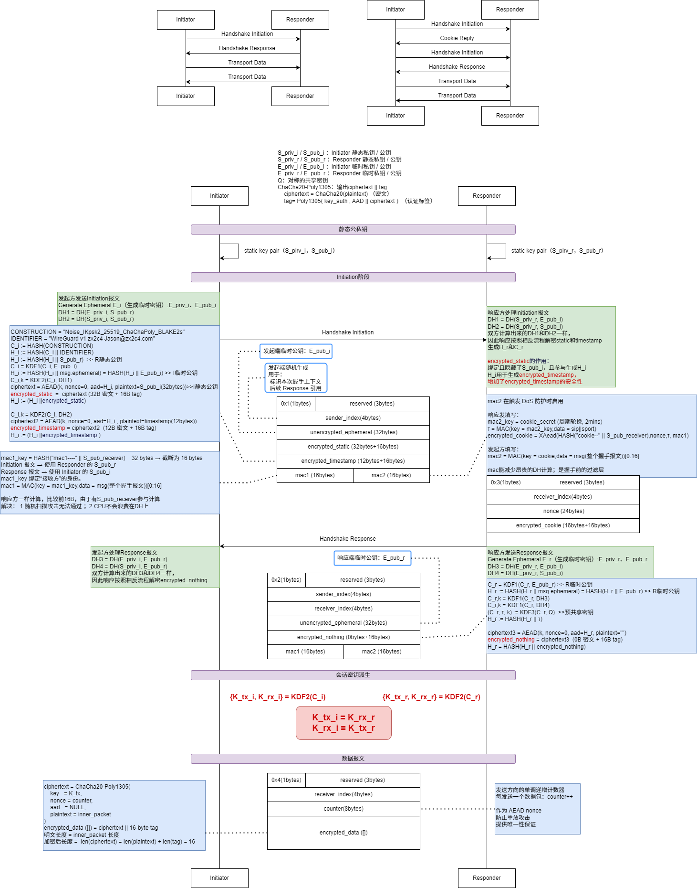
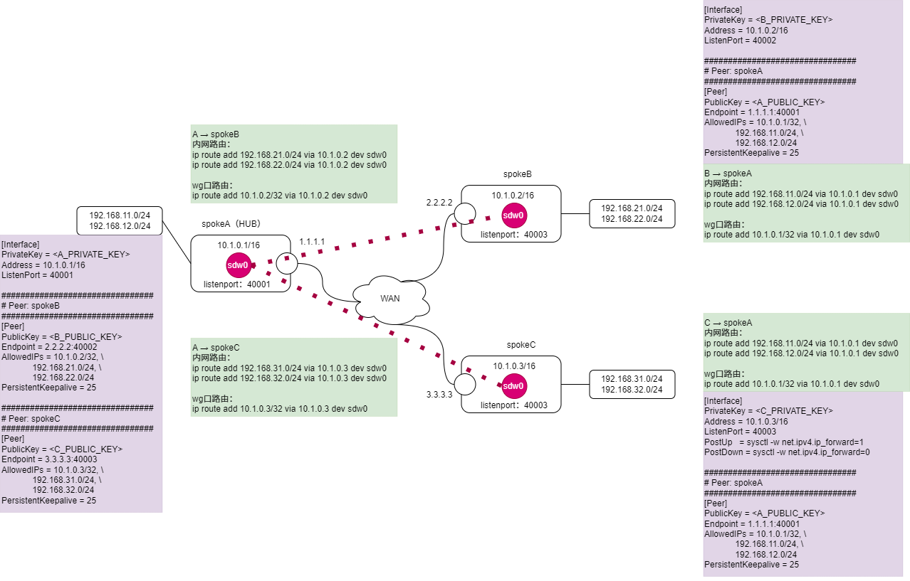

## 算法
ProtocolName = "Noise_IKpsk2_25519_ChaChaPoly_BLAKE2s"   

| 类别     | 算法                  | 用途                           |
| ------ | ------------------- | ---------------------------- |
| 公钥     | Curve25519 (X25519) | DH 密钥交换                      |
| 对称加密   | ChaCha20            | 流加密                          |
| 认证     | Poly1305            | MAC（与 ChaCha20 组成 AEAD）      |
| AEAD   | ChaCha20-Poly1305   | 握手与数据加密                      |
| 哈希     | BLAKE2s             | transcript hash / KDF / MAC1 |
| KDF    | HKDF-BLAKE2s        | chaining key 推导              |


## 交互过程


## 安全性保证
### 关键信息
WireGuard 握手阶段需要同时满足：  
* 双方身份认证（Mutual Authentication）  
* 前向安全（Forward Secrecy）  
* 抗重放  
* 抗 DoS  
* 密钥确认（Implicit Key Confirmation）  
* 握手完整性绑定（Transcript Integrity）  

所有这些由以下组件共同完成：
```
DH
ck（chaining key）
h（handshake hash）
AEAD
MAC1 / MAC2
timestamp
```
### DH的作用

| 测试       | Initiation | Responsder |
| --------   | ----       | ------     |
| DH1        | DH(E_priv_i, S_pub_r)    | DH(S_priv_r, E_pub_i) |
| DH2        | DH(S_priv_i, S_pub_r)    | DH(S_priv_r, S_pub_i) |
| DH3        | DH(E_priv_i, E_pub_r)    | DH(E_priv_r, E_pub_i) |
| DH4        | DH(S_priv_i, E_pub_r)    | DH(E_priv_r, S_pub_i) |

#### DH(E_i, S_r)
作用：
* 保证只有持有 S_priv_r 的响应方能解密 Initiation
* 防止第三方窃听
* 提供单向认证基础

#### DH(S_i, S_r)
作用：
* 绑定双方静态身份(S_pub_i, S_pub_r)
* 保证 mutual authentication  

即：
> 只有真正拥有 S_priv_i 的发起方才能完成握手

#### DH(E_i, E_r)
作用：
* 提供前向安全
* 即使静态私钥泄露，历史会话不可恢复

#### DH(S_i, E_r)
作用：
* 双向身份绑定(S_pub_i, E_pub_r)
* 防止中间人攻击

### ck（Chaining Key）的作用
```
ck0 = Hash("Noise_IKpsk2_25519_ChaChaPoly_BLAKE2s")
ck1 = HKDF(ck0, DH1)
ck2 = HKDF(ck1, DH2)
ck3 = HKDF(ck2, DH3)
ck4 = HKDF(ck3, DH4)
```
**ck 的作用**
  * 将多个 DH 安全组合
  * 提供 KDF 安全边界
  * 防止单个 DH 被攻击时影响整体

**ck 的安全意义**
* 所有会话密钥来自 ck
* 若任意一个 DH 值不同 → 最终会话密钥完全不同
* 提供密钥独立性

### h（handshake_hash）的作用
```
ProtocolName = "Noise_IKpsk2_25519_ChaChaPoly_BLAKE2s"
h = BLAKE2s(ProtocolName)  >>  协议标识
h = BLAKE2s(h || S_pub_r)  >> Responder 静态公钥
h = BLAKE2s(h || E_pub_i) >> Inittiation 临时公钥
ciphertext = AEAD(k_hs_i, nonce=0, aad=h, plaintext=S_pub_i(32bytes))
encrypted_static  =  ciphertext (32B 密文 + 16B tag)
h = BLAKE2s(h || ciphertext)
ciphertext2 = AEAD(k_hs_i, nonce=0, aad=h, plaintext=timestamp(12bytes))
encrypted_timestamp = ciphertext2  (12B 密文 + 16B tag)
h = BLAKE2s(h || ciphertext2)
```
#### 绑定握手上下文
* 绑定 E_pub_i
* 绑定 E_pub_r
* 绑定 encrypted_static
* 绑定 encrypted_timestamp

防止：
* 报文重排序
* 替换攻击
* 反射攻击

#### 作为 AEAD 的 AAD
```
ciphertext = AEAD(key, nonce=0, aad=h, plaintext=m)
``` 
这保证：握手报文中的加密字段必须匹配完整 transcript,否则解密失败。


### AEAD 的作用
用于加密：
* encrypted_static
* encrypted_timestamp
* encrypted_nothing

作用：
* 保证机密性
* 保证完整性
* 提供身份隐藏（Initiator 的静态公钥被加密）

### timestamp 的作用
encrypted_timestamp：
* 防止 replay attack
* Responder 检查是否为旧时间戳

保证：Initiation 报文不能被重放成功

### MAC1 和 MAC2 的作用
#### MAC1
```
mac1 = BLAKE2s(key = BLAKE2s("mac1----" || S_pub_receiver) ,data = msg(整个握手报文))[0:16]
```
作用：
* 过滤非授权流量
* 防止随机包进入 Noise 状态机

#### MAC2（cookie）
```
mac2_key = cookie_secret (周期轮换)
cookie = BLAKE2s(key = mac2_key,data = sip||sport)
mac2 = BLAKE2s(key = cookie,data = msg(整个握手报文))[0:16]
```
用于：
* 抗 DoS
* 只有在负载攻击时才启用

机制：
* Responder 返回 cookie
* Initiator 必须携带正确 MAC2 （使用解密后的cookie加密）才会被处理

### 会话密钥派生
```
{K_tx_i, K_rx_i} = HKDF(ck4)
{K_tx_r, K_rx_r} = HKDF(ck4)

K_tx_i = K_rx_r
K_rx_i = K_tx_r
```
保证：

* 双方计算一致
* 攻击者无法预测
* 具备前向安全

### 隐式密钥确认
当 Initiator 成功解密 Response：  
说明：
* Responder 拥有 S_priv_r
* 所有 DH 正确
* ck 一致

当 Responder 成功解密数据报文：
说明：
* Initiator 收到 Response
* 双方会话密钥一致   

无需第三次握手。

### 综合安全性总结

| 组件            | 提供的安全属性        |
| ------------- | -------------- |
| DH            | 密钥协商 + 前向安全    |
| ck            | 安全 KDF 链       |
| h             | transcript 完整性 |
| AEAD          | 机密性 + 完整性      |
| timestamp     | 抗重放            |
| MAC1          | 抗未授权流量         |
| MAC2          | 抗 DoS          |
| ephemeral key | 前向安全           |
| 会话密钥分离        | 双向独立加密         |

## 配置举例
